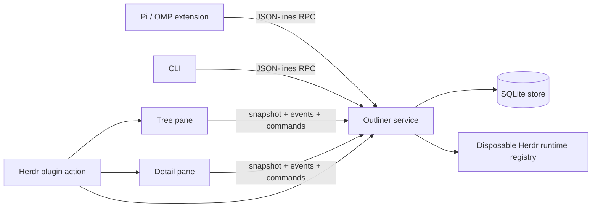

# Architecture

Pi Herdr Outliner is a service-backed terminal application. SQLite and the block graph live in one canonical process; every UI and agent surface is a client.

## Process topology



### Service

[`src/server-main.ts`](../src/server-main.ts) owns:

- one [`OutlinerStore`](../src/store.ts),
- one [`OutlinerServer`](../src/server.ts),
- the workspace Unix socket,
- service-pane registration, and
- the optional Herdr runtime-registry runner.

The service is the only process that opens the workspace SQLite database. It logs the resolved socket and database paths after startup and handles orderly shutdown on `SIGINT`, `SIGTERM`, or `SIGHUP`.

### Tree client

[`src/outliner.ts`](../src/outliner.ts) is a standalone terminal process using:

- [`TreeController`](../src/tree-controller.ts) for behavior,
- [`renderTreeFrame`](../src/tree-renderer.ts) for ANSI rendering,
- [`virtual-branches.ts`](../src/virtual-branches.ts) for projections, and
- [`OutlinerClient.watch()`](../src/client.ts) for reactive updates.

Tree holds no canonical block state. It reconstructs from a service snapshot and events.

Tree keeps an ephemeral visual-row offset for the selected multiline-expanded block. PageUp/PageDown move that offset by one Tree body viewport and clamp to the wrapped row count; Up/Down continue to change canonical block selection. Selection, reveal, collapse/expansion, and reconnect changes reset the offset.

### Detail client

[`src/detail-main.ts`](../src/detail-main.ts) selects the Pi TUI Detail implementation, which separates:

- [`DetailController`](../src/detail-controller.ts) — modes, effects, optimistic saves, completion, file/annotation behavior, and cursor visibility;
- [`detail-pi.ts`](../src/detail-pi.ts) — terminal lifecycle, input, and Pi layout switching;
- [`detail-pi-preview.ts`](../src/detail-pi-preview.ts) — Markdown `ScrollView` preview;
- [`detail-editor-layout.ts`](../src/detail-editor-layout.ts) — grapheme-safe wrapped visual rows, cursor mapping, and selection spans;
- [`detail-renderer.ts`](../src/detail-renderer.ts) — fixed custom frames for edit, comment, file, and annotation modes; and
- [`text-buffer.ts`](../src/text-buffer.ts) — raw text, grapheme/word movement, and selections.

The legacy ANSI Detail entrypoint remains available in [`src/detail.ts`](../src/detail.ts), but the Herdr manifest starts [`src/detail-main.ts`](../src/detail-main.ts).

### Pi / OMP extension

[`pi-extension/index.ts`](../pi-extension/index.ts) is a host adapter. It:

- starts or locates the service,
- opens Herdr panes through the plugin action,
- exposes outliner tools and commands, and
- injects bounded selection context before agent turns.

Persistence, protocol, and rendering do not depend on the agent process surviving.

## Workspace identity and runtime paths

[`resolvePaths()`](../src/paths.ts) resolves a workspace root from `OUTLINER_WORKSPACE_ROOT` or `process.cwd()`. The first 12 hexadecimal characters of its SHA-256 hash identify a workspace state directory:

```text
${OUTLINER_STATE_DIR:-~/.local/state/pi-herdr-outliner}/<workspace-hash>/
```

The directory contains the SQLite database, Unix socket, and remembered plugin-pane metadata. This prevents two repositories from accidentally sharing blocks or selection.

Every process must resolve the same workspace root. Herdr pane commands explicitly pass the invoking pane’s foreground working directory to new plugin panes.

## Canonical data model

The SQLite schema is created in [`OutlinerStore.migrate()`](../src/store.ts):

### `blocks`

| Column | Meaning |
| --- | --- |
| `id` | Stable UUID primary key |
| `parent_id` | Canonical parent; cascading delete |
| `position` | Sibling order beneath the parent |
| `text` | Canonical raw block text |
| `author` | `user`, `agent`, or `system` |
| `actor_id`, `session_id`, `task_id` | Optional immutable creator provenance for agent-authored blocks |
| `collapsed` | Physical-tree collapse state |
| `deleted_at` | Direct tombstone timestamp; null for blocks not independently deleted |
| `effective_deleted_root_id` | Materialized nearest direct deleted ancestor, including self |
| `created_at`, `updated_at` | Version and audit timestamps |

### `block_properties`

Derived index of eligible `[key::value]` tokens. `(block_id, key, ordinal)` preserves repeated keys and text order. `(key, value)` is indexed for queries.

Canonical text is authoritative. Property updates patch text with optimistic concurrency, then re-index it. The parser version is persisted in `metadata`; a newer parser can rebuild the derived index without changing canonical block timestamps.

Literal property-looking text inside inline code, fenced code, or escaped syntax is not indexed.

### Other tables

- `metadata` — service sequence, parser version, and navigation cursor.
- `selection` — one selected canonical block per workspace.
- `navigation_history` — the latest 200 canonical selection visits, suppressing consecutive duplicates; purged block foreign keys become null so traversal skips them.
- `block_view_state` — UI state such as multiline expansion without changing canonical text.
- `virtual_occurrence_ranks` — durable `(virtual-branch ID, canonical block ID) -> branch-local rank`; both foreign keys cascade on deletion.
- `page_addresses` — unique normalized symbolic address to canonical block mapping for page declarations, Work IDs, and explicit aliases; foreign keys cascade only on physical purge.

## Protocol

The current protocol version is `8`, defined in [`src/types.ts`](../src/types.ts). Requests and responses are newline-delimited JSON over the workspace Unix socket.

### Important request families

- health: `ping`
- canonical reads: `get`, `children`, `workspace.snapshot`
- bounded search: `blocks.query`
- mutations: `create`, `update`, `move`, `delete` (move to Trash), `trash.restore`, `trash.purge`, `toggle`
- properties: `properties.patch`, `properties.catalog`
- virtual ordering: `virtual.occurrences.reorder`
- references: `references.resolve`
- symbolic addresses: `pages.resolve`, `pages.follow`, `pages.complete`, `pages.rename`, `pages.alias`, `pages.remove`
- selection: `selection.get`, `selection.set`
- navigation: `navigation.state`, `navigation.back`, `navigation.forward`
- reactive clients: `events.subscribe`
- cross-pane behavior: `ui.command.send`

### Agent provenance

`author` remains the coarse `user | agent | system` role used by renderers and existing clients. Agent creation requests may additionally carry `{ actorId, sessionId?, taskId? }`; the service accepts that provenance only with `author: "agent"`, stores it on the new block, and never rewrites it during later content updates.

The Pi/OMP adapter forces `author: "agent"`. It identifies the host as `pi` or `omp`, reads the durable session ID from Pi's `ExtensionContext.sessionManager`, and records the tool-call ID as the originating task ID. Legacy and user-authored blocks omit these optional fields.

### Clickable outliner identities

Herdr recognizes plain terminal text as a URL only for `http://` and `https://`. Outliner renderers therefore generate trusted OSC 8 hyperlinks with private URIs instead of expecting link-handler regexes to scan arbitrary text:

- `pi-outliner://block/<uuid>` — exact canonical block;
- `pi-outliner://goto/<encoded-query>` — shared fuzzy goto resolution;
- `pi-outliner://work/<PIE-NNN>` — resolve-only Work-ID registry lookup;
- `pi-outliner://page/<encoded-address>` — unique symbolic page resolution and explicit create-on-follow.

Inside the live panes, navigation stays in-process. Tree enables SGR mouse reporting, keeps the last rendered frame, resolves an unmodified primary click against that frame's OSC 8 cell metadata, and delegates to `navigateOutlinerLink`. Detail supplies the same helper as Pi TUI's `openUrl` callback. Exact block and resolved symbolic links select one canonical UUID directly, so deleted targets cannot degrade into fuzzy text matches. Deleted targets open read-only in Detail; active targets send exact Tree focus/reveal.

Authored text is sanitized before link generation. Tree adds OSC 8 only after plain-text wrapping/truncation; Detail generates safe Markdown links after sanitization. Under `HERDR_ENV=1`, Detail enables Pi TUI hyperlink emission because nested panes advertise generic `TERM=xterm-256color` even though Herdr captures OSC 8 metadata. Tree ignores modified, release, motion, and wheel reports for link activation; Shift remains available for terminal-native selection.

The `outliner-navigation` manifest handler and `src/herdr-link-open.ts` remain the external/interoperability path for rendered output outside the active TUI. They validate/decode the private URI, resolve the clicked pane workspace, and enter the same shared navigation helper. `[[address]]` remains visible when dangling; the explicit follow action creates exactly one root stub through the transactional registry path.


### macOS native URL bridge

Real Ghostty/Warp/xterm-based clients do not reliably deliver Herdr's documented Control-modified left click: macOS may translate it to secondary click, while Command-click is consumed by the local terminal and sent to LaunchServices. `macos/pi-outliner-link` is an optional local app bundle for that boundary.

The app registers `pi-outliner://`, accepts exact block, fuzzy goto, symbolic page, and resolve-only Work-ID routes, rejects terminal controls and URL decorations, reads a local host/workspace/Bun configuration, and invokes `/usr/bin/ssh` in batch mode. The installer stores the selected configuration path in bundle metadata because apps opened by LaunchServices do not inherit the installer's shell environment. The remote command forwards the validated private URL through `src/cli.ts link --url`, so registry resolution, canonical selection, and Tree reveal remain server-owned. Host and paths are validated and shell-quoted; authored URL content never becomes an unchecked remote command.

The default bridge targets `evan@float-box:/home/evan/test`, which resolves over Tailscale MagicDNS without exposing a public service. Warp activates it with Command-click; Ghostty uses Shift-Command-click to bypass mouse capture. This bridge is an immediate per-device workaround, not a replacement for the requested opt-in plain-click Herdr plugin-handler mode tracked upstream.

Every response carries the service sequence. Every mutation increments it and emits an event.

### Complete versus bounded collections

`blocks.query` requires a positive limit and returns:

```ts
interface VisibleBlockCollection {
  blocks: VisibleBlock[];
  completeness:
    | { kind: "complete" }
    | { kind: "truncated"; limit: number };
}
```

Clients must never infer absence from a truncated collection. Workspace snapshots carry separate visible and complete physical collections so projections are not derived from a collapse-pruned tree.

## Reactive flow

1. A client obtains a workspace snapshot.
2. It subscribes to service events.
3. Mutations occur through RPC.
4. The service emits a domain event: `content`, `selection`, `view`, or `ui`.
5. Tree and Detail reload or perform a targeted UI command.
6. On reconnect, clients reconstruct from the canonical service rather than replaying guessed local state.

While Detail is editing/commenting, content refreshes are marked pending instead of replacing the active raw buffer. Save uses `expectedUpdatedAt`; conflicts preserve the buffer and surface the error. Esc cancels the buffer, after which pending selection can reload.

Navigation history is service-owned and shares the canonical selection path used by Tree, Detail, goto, direct links, and agents. A distinct non-null `selection.set` appends a visit. `navigation.back` and `navigation.forward` move a persisted cursor without appending; a later selection truncates the forward branch. The store retains 200 rows. Soft-deleted targets remain addressable and open read-only in Detail; purge nulls their history foreign keys and traversal skips those rows.

## Properties and references

Properties are Roam-style textual metadata:

```text
Question [type::question] [status::open]
```

Query filters compare indexed keys and optional exact values. Property patches address token ordinals so an agent can replace/remove/append metadata without rewriting unrelated prose.

Exact references use `((block-id))`. Read paths replace a resolvable ID with the target’s first non-property content line. Edit paths retain the raw ID. Dangling exact references remain unchanged.

Symbolic references use `[[address]]`. The registry compares trimmed, Unicode-normalized, caseless, whitespace-collapsed keys while preserving the authored address label. One `[page::address]` declaration registers a page; `[work-id::PIE-NNN]` registers the same canonical block under its Work ID. Bare Work IDs navigate through a resolve-only registry path rather than fuzzy goto, and unresolved Work-ID-shaped addresses cannot create page stubs. Parsing and ordinary saves never create a referenced block. `pages.follow` transactionally resolves or creates one ordinary root stub. General edits cannot silently change or remove a registered declaration: `pages.rename` uses optimistic concurrency, changes the primary declaration, and retains the former address as an alias; `pages.alias` adds another explicit address; `pages.remove` explicitly unregisters an alias or primary declaration. Registry rebuilds preserve aliases.

The initial registry migration backfills active declarations only. Pre-PIE-132 Trash content can contain indexed property-shaped examples and copied Work IDs that never established symbolic identity; importing those would either create false addresses or block startup. Registry rebuilds retain addresses already owned by deleted blocks. Restoring a legacy Trash subtree registers newly active declarations only when they are unambiguous and unclaimed. Legacy registration is block-atomic: one ambiguous declaration suppresses every address on that block until repair. The block still restores as ordinary editable content and can register through a subsequent valid edit.

## Recoverable deletion and Trash

Deletion changes canonical block state, not canonical location. `parent_id`, `position`, UUID, text, properties, descendants, and branch-local ranks remain intact. A direct deletion sets `deleted_at`; `effective_deleted_root_id` materializes the nearest direct deleted ancestor for every block. The service recomputes that field transactionally on delete/restore/purge and backfills it in the same transaction that introduces the column during migration. This deliberately pays bounded descendant/all-row writes on rare Trash mutations so every common read can exclude deleted content with one indexed scalar check instead of an ancestry walk or recursive CTE.

Canonical deletion does not choose a replacement selection or write navigation history. The initiating Tree selects a projection-local fallback before issuing delete: the visual successor after removing the canonical subtree, otherwise the previous surviving row. It publishes that canonical selection first, then deletes and reloads by the fallback's exact row identity. For external content events that make the current row vanish, Tree reconciles at the same visual position and republishes the resulting selection; it never jumps to a physical, Trash, or unrelated branch occurrence merely because it shares the vanished row's canonical ID.

Normal traversal, workspace snapshots, bounded/ranked queries, property catalogs, completions, goto candidates, and virtual branches centrally require `effective_deleted_root_id IS NULL`. Exact `get` remains identity-aware and can inspect a tombstone. Mutation APIs reject effectively deleted blocks except explicit Trash operations.

The store ensures one ordinary canonical system view:

```text
Trash [type::virtual-branch] [system-view::trash] [query::deleted=true]
```

The special `deleted=true` query returns direct deletion roots only. It is read-only because it has no create configuration. Root rows include an effective descendant count; Detail previews deleted selection read-only. `r` clears only the selected root's direct marker, so independently deleted descendants stay deleted. `p` requires the exact work ID or eight-character block prefix before physical purge.

References resolve to three states. Active targets render normally; effectively deleted targets retain their title with a Trash marker and deletion-root identity; purged/missing targets remain dangling. Following an exact deleted block link selects it for read-only Detail inspection rather than silently failing or restoring it.

Symbolic addresses use the same lifecycle distinction. Soft deletion retains the registry row and resolves to the read-only tombstone. Purge cascades registry rows, so the former address becomes genuinely missing and may create a new stub only on a later explicit follow.

Permanent purge is manual and irreversible. It physically deletes the canonical subtree through existing foreign-key cascades. Before deletion, every subtree work ID is copied into `reserved_work_ids`; future work-ID allocation must consult that ledger so deleted or purged identifiers are never reused.

## Virtual branches

A virtual branch is an ordinary canonical block with exactly one `[type::virtual-branch]` token and exactly one `[query::…]` token.

Optional properties:

- `[limit::N]` — bounded query size, from 1 through 1000.
- `[create::key=value]` — one property applied to new canonical children.
- `[create-parent::<block-id>]` — physical parent for branch-created blocks.

Tree queries the service and inserts disposable occurrence rows. Each occurrence carries:

- `rowId` — occurrence identity,
- `canonicalId` — mutation target,
- `viewId` — virtual branch definition, and
- canonical `Block` data.

Occurrences do not have hierarchy. Tree allows canonical edit/reveal and explicit canonical deletion, rejects projected indent, outdent, and collapse, and maps `Shift+Up` / `Shift+Down` to branch-local reorder.

`workspace.snapshot` carries every persisted occurrence rank in the same transactional read as the block graph. Tree supplies the branch `viewId` on its bounded match query; storage orders matching ranked blocks first, then deterministic unranked results, and returns only the configured window plus overflow detection. Projection reapplies the snapshot ranks defensively before the branch limit. Reorder ranks the complete currently projected sibling sequence without changing canonical parents/positions or another branch. Rank rows survive temporary query mismatches and cascade when either the branch definition or canonical block is deleted.

## Detail rendering and editing invariants

### Preview

- Complete resolved block text is passed to Pi Markdown.
- Header and footer remain fixed while the primary `ScrollView` scrolls.
- Raw source and Markdown renders are cached when unchanged.
- Selection changes and transitions into preview reset scroll to the top.

### Editor

- `TextBuffer.text` is raw canonical text.
- Physical lines wrap into visual rows without inserting newlines.
- Wrapping and cursor movement respect Unicode grapheme clusters and terminal display width.
- One software-cursor cell is reserved so frames never overflow.
- Selection is normalized between an anchor and active cursor, may span physical lines, and renders in reverse video across wrapped rows.
- Typing/newline replaces a selection; Backspace/Delete removes it.
- The controller keeps the active visual cursor row inside the editor viewport, including completion-height and terminal-size changes.
- Completion replaces raw line ranges and does not resolve block references into saved text.
- Ctrl+S uses optimistic concurrency. Esc discards the complete edit session.

Editor undo/redo stores at most 100 per-session snapshots. Consecutive typing, backspace, and forward delete coalesce; cursor and selection state restore with text; divergent edits invalidate redo. New edit/comment sessions start with empty history. Modal editing, registers, macros, and programmable operator systems remain explicit non-goals for the custom buffer.

## File annotations

A block containing `[file::path]` can open a workspace-relative text or Markdown file. Detail supports line navigation and range selection. A comment creates a canonical child annotation containing source path, normalized line range, source block ID, and comment text.

The service stores annotation blocks; it does not modify source files.

## Herdr lifecycle

[`src/herdr-open.ts`](../src/herdr-open.ts) enforces service-first startup:

1. Reuse or open the service pane in a tab.
2. Wait for a compatible protocol response.
3. Reuse or open Tree beside the invoking pane.
4. Reuse or open Detail beneath Tree.
5. Focus Tree unless `OUTLINER_FOCUS=0`.

Pane IDs are read from Herdr responses and persisted as hints. Stale hints are validated and replaced; IDs are never predicted.

After deploying a merged change, restart Detail, Tree, and service in that order, invoke the plugin action, wait for `herdr_registry_ready`, and exercise the changed surface.

## Repository map

```text
src/store.ts                  SQLite block graph, property index, and symbolic-address registry
src/page-addresses.ts         symbolic-address validation, normalization, and syntax scanning
src/server.ts                 protocol and subscriptions
src/client.ts                 request/watch client
src/server-main.ts            canonical service process
src/outliner.ts               Tree terminal process
src/tree-controller.ts        Tree behavior
src/tree-renderer.ts          Tree ANSI rendering
src/virtual-branches.ts       projection configuration and rows
src/detail-main.ts            Detail implementation selector
src/outliner-links.ts          private URI codec and safe Tree/Markdown link generation
src/herdr-link-open.ts         Herdr link-handler action using shared goto/reveal
src/detail-controller.ts      Detail behavior and effects
src/detail-pi*.ts             Pi TUI preview/input/frame integration
src/detail-editor-layout.ts   wrapped visual rows and selections
src/text-buffer.ts            raw editor state
src/herdr-open.ts             plugin pane orchestration
src/herdr-registry.ts         disposable runtime metadata
pi-extension/index.ts         Pi/OMP commands, tools, context hook
```

## Accepted designs not yet implemented

The durable roadmap lives in the outliner workboard. Current accepted designs include backlinks, scoped property semantics, retained Detail targets, projected canonical descendants, and projected-child creation.

Do not describe these as shipped behavior until their roadmap items are Complete on main.
