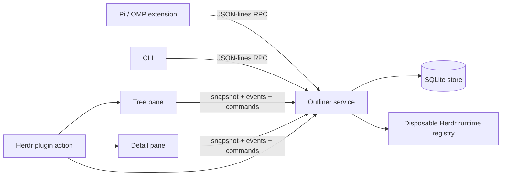

# Architecture

Pi Herdr Outliner is a service-backed terminal application. SQLite and the block graph live in one canonical process; every UI and agent surface is a client.

## Process topology



### Service

[`src/server-main.ts`](../src/server-main.ts) owns:

- one [`OutlinerStore`](../src/store.ts),
- one [`OutlinerServer`](../src/server.ts),
- the workspace Unix socket,
- service-pane registration, and
- the optional Herdr runtime-registry runner.

The service is the only process that opens the workspace SQLite database. It logs the resolved socket and database paths after startup and handles orderly shutdown on `SIGINT`, `SIGTERM`, or `SIGHUP`.

### Tree client

[`src/outliner.ts`](../src/outliner.ts) is a standalone terminal process using:

- [`TreeController`](../src/tree-controller.ts) for behavior,
- [`renderTreeFrame`](../src/tree-renderer.ts) for ANSI rendering,
- [`virtual-branches.ts`](../src/virtual-branches.ts) for projections, and
- [`OutlinerClient.watch()`](../src/client.ts) for reactive updates.

Tree holds no canonical block state. It reconstructs from a service snapshot and events.

Tree keeps an ephemeral visual-row offset for the selected multiline-expanded block. PageUp/PageDown move that offset by one Tree body viewport and clamp to the wrapped row count; Up/Down continue to change canonical block selection. Selection, reveal, collapse/expansion, and reconnect changes reset the offset.

### Detail client

[`src/detail-main.ts`](../src/detail-main.ts) selects the Pi TUI Detail implementation, which separates:

- [`DetailController`](../src/detail-controller.ts) — modes, effects, optimistic saves, completion, file/annotation behavior, and cursor visibility;
- [`detail-pi.ts`](../src/detail-pi.ts) — terminal lifecycle, input, and Pi layout switching;
- [`detail-pi-preview.ts`](../src/detail-pi-preview.ts) — Markdown `ScrollView` preview;
- [`detail-editor-layout.ts`](../src/detail-editor-layout.ts) — grapheme-safe wrapped visual rows, cursor mapping, and selection spans;
- [`detail-renderer.ts`](../src/detail-renderer.ts) — fixed custom frames for edit, comment, file, and annotation modes; and
- [`text-buffer.ts`](../src/text-buffer.ts) — raw text, grapheme/word movement, and selections.

The legacy ANSI Detail entrypoint remains available in [`src/detail.ts`](../src/detail.ts), but the Herdr manifest starts [`src/detail-main.ts`](../src/detail-main.ts).

### Pi / OMP extension

[`pi-extension/index.ts`](../pi-extension/index.ts) is a host adapter. It:

- starts or locates the service,
- opens Herdr panes through the plugin action,
- exposes outliner tools and commands, and
- injects bounded selection context before agent turns.

Persistence, protocol, and rendering do not depend on the agent process surviving.

## Workspace identity and runtime paths

[`resolvePaths()`](../src/paths.ts) resolves a workspace root from `OUTLINER_WORKSPACE_ROOT` or `process.cwd()`. The first 12 hexadecimal characters of its SHA-256 hash identify a workspace state directory:

```text
${OUTLINER_STATE_DIR:-~/.local/state/pi-herdr-outliner}/<workspace-hash>/
```

The directory contains the SQLite database, Unix socket, and remembered plugin-pane metadata. This prevents two repositories from accidentally sharing blocks or selection.

Every process must resolve the same workspace root. Herdr pane commands explicitly pass the invoking pane’s foreground working directory to new plugin panes.

## Canonical data model

The SQLite schema is created in [`OutlinerStore.migrate()`](../src/store.ts):

### `blocks`

| Column | Meaning |
| --- | --- |
| `id` | Stable UUID primary key |
| `parent_id` | Canonical parent; cascading delete |
| `position` | Sibling order beneath the parent |
| `text` | Canonical raw block text |
| `author` | `user`, `agent`, or `system` |
| `collapsed` | Physical-tree collapse state |
| `created_at`, `updated_at` | Version and audit timestamps |

### `block_properties`

Derived index of eligible `[key::value]` tokens. `(block_id, key, ordinal)` preserves repeated keys and text order. `(key, value)` is indexed for queries.

Canonical text is authoritative. Property updates patch text with optimistic concurrency, then re-index it. The parser version is persisted in `metadata`; a newer parser can rebuild the derived index without changing canonical block timestamps.

Literal property-looking text inside inline code, fenced code, or escaped syntax is not indexed.

### Other tables

- `metadata` — service sequence and parser version.
- `selection` — one selected canonical block per workspace.
- `block_view_state` — UI state such as multiline expansion without changing canonical text.

## Protocol

The current protocol version is `3`, defined in [`src/types.ts`](../src/types.ts). Requests and responses are newline-delimited JSON over the workspace Unix socket.

### Important request families

- health: `ping`
- canonical reads: `get`, `children`, `workspace.snapshot`
- bounded search: `blocks.query`
- mutations: `create`, `update`, `move`, `delete`, `toggle`
- properties: `properties.patch`, `properties.catalog`
- references: `references.resolve`
- selection: `selection.get`, `selection.set`
- reactive clients: `events.subscribe`
- cross-pane behavior: `ui.command.send`

Every response carries the service sequence. Every mutation increments it and emits an event.

### Complete versus bounded collections

`blocks.query` requires a positive limit and returns:

```ts
interface VisibleBlockCollection {
  blocks: VisibleBlock[];
  completeness:
    | { kind: "complete" }
    | { kind: "truncated"; limit: number };
}
```

Clients must never infer absence from a truncated collection. Workspace snapshots carry separate visible and complete physical collections so projections are not derived from a collapse-pruned tree.

## Reactive flow

1. A client obtains a workspace snapshot.
2. It subscribes to service events.
3. Mutations occur through RPC.
4. The service emits a domain event: `content`, `selection`, `view`, or `ui`.
5. Tree and Detail reload or perform a targeted UI command.
6. On reconnect, clients reconstruct from the canonical service rather than replaying guessed local state.

While Detail is editing/commenting, content refreshes are marked pending instead of replacing the active raw buffer. Save uses `expectedUpdatedAt`; conflicts preserve the buffer and surface the error. Esc cancels the buffer, after which pending selection can reload.

## Properties and references

Properties are Roam-style textual metadata:

```text
Question [type::question] [status::open]
```

Query filters compare indexed keys and optional exact values. Property patches address token ordinals so an agent can replace/remove/append metadata without rewriting unrelated prose.

Exact references use `((block-id))`. Read paths replace a resolvable ID with the target’s first non-property content line. Edit paths retain the raw ID. Dangling references remain unchanged.

Symbolic `[[address]]` pages, aliases, `PIE-NNN` work IDs, and backlinks are accepted roadmap designs, not current protocol behavior.

## Virtual branches

A virtual branch is an ordinary canonical block with exactly one `[type::virtual-branch]` token and exactly one `[query::…]` token.

Optional properties:

- `[limit::N]` — bounded query size, from 1 through 1000.
- `[create::key=value]` — one property applied to new canonical children.
- `[create-parent::<block-id>]` — physical parent for branch-created blocks.

Tree queries the service and inserts disposable occurrence rows. Each occurrence carries:

- `rowId` — occurrence identity,
- `canonicalId` — mutation target,
- `viewId` — virtual branch definition, and
- canonical `Block` data.

Occurrences do not have hierarchy. Tree allows canonical edit/reveal and explicit canonical deletion, but rejects projected indent, outdent, collapse, and sibling reorder where semantics would be ambiguous.

Accepted future behavior stores order as `(virtual-branch ID, canonical block ID) -> branch-local rank`, never as canonical sibling position.

## Detail rendering and editing invariants

### Preview

- Complete resolved block text is passed to Pi Markdown.
- Header and footer remain fixed while the primary `ScrollView` scrolls.
- Raw source and Markdown renders are cached when unchanged.
- Selection changes and transitions into preview reset scroll to the top.

### Editor

- `TextBuffer.text` is raw canonical text.
- Physical lines wrap into visual rows without inserting newlines.
- Wrapping and cursor movement respect Unicode grapheme clusters and terminal display width.
- One software-cursor cell is reserved so frames never overflow.
- Selection is normalized between an anchor and active cursor, may span physical lines, and renders in reverse video across wrapped rows.
- Typing/newline replaces a selection; Backspace/Delete removes it.
- The controller keeps the active visual cursor row inside the editor viewport, including completion-height and terminal-size changes.
- Completion replaces raw line ranges and does not resolve block references into saved text.
- Ctrl+S uses optimistic concurrency. Esc discards the complete edit session.

Editor undo/redo stores at most 100 per-session snapshots. Consecutive typing, backspace, and forward delete coalesce; cursor and selection state restore with text; divergent edits invalidate redo. New edit/comment sessions start with empty history. Modal editing, registers, macros, and programmable operator systems remain explicit non-goals for the custom buffer.

## File annotations

A block containing `[file::path]` can open a workspace-relative text or Markdown file. Detail supports line navigation and range selection. A comment creates a canonical child annotation containing source path, normalized line range, source block ID, and comment text.

The service stores annotation blocks; it does not modify source files.

## Herdr lifecycle

[`src/herdr-open.ts`](../src/herdr-open.ts) enforces service-first startup:

1. Reuse or open the service pane in a tab.
2. Wait for a compatible protocol response.
3. Reuse or open Tree beside the invoking pane.
4. Reuse or open Detail beneath Tree.
5. Focus Tree unless `OUTLINER_FOCUS=0`.

Pane IDs are read from Herdr responses and persisted as hints. Stale hints are validated and replaced; IDs are never predicted.

After deploying a merged change, restart Detail, Tree, and service in that order, invoke the plugin action, wait for `herdr_registry_ready`, and exercise the changed surface.

## Repository map

```text
src/store.ts                  SQLite block graph and property index
src/server.ts                 protocol and subscriptions
src/client.ts                 request/watch client
src/server-main.ts            canonical service process
src/outliner.ts               Tree terminal process
src/tree-controller.ts        Tree behavior
src/tree-renderer.ts          Tree ANSI rendering
src/virtual-branches.ts       projection configuration and rows
src/detail-main.ts            Detail implementation selector
src/detail-controller.ts      Detail behavior and effects
src/detail-pi*.ts             Pi TUI preview/input/frame integration
src/detail-editor-layout.ts   wrapped visual rows and selections
src/text-buffer.ts            raw editor state
src/herdr-open.ts             plugin pane orchestration
src/herdr-registry.ts         disposable runtime metadata
pi-extension/index.ts         Pi/OMP commands, tools, context hook
```

## Accepted designs not yet implemented

The durable roadmap lives in the outliner workboard. Current accepted designs include:

- branch-local virtual occurrence ordering,
- safe canonical block deletion,
- reference navigation and back history,
- symbolic page addresses and create-on-follow stubs,
- project-scoped `PIE-NNN` work IDs,
- backlinks,
- pinned reference panes.

Do not describe these as shipped behavior until their roadmap items are Complete on main.
