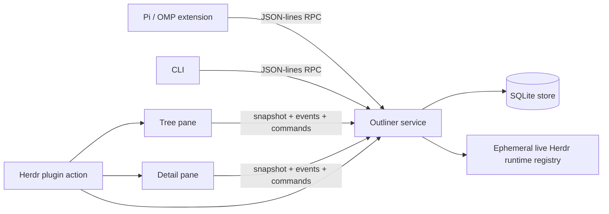

# Architecture

Pi Herdr Outliner is a service-backed terminal application. SQLite and the block graph live in one canonical process; every UI and agent surface is a client.

## Process topology


```mermaid
flowchart LR
    Pi[Pi / OMP extension] -->|JSON-lines RPC| Service
    CLI[CLI] -->|JSON-lines RPC| Service
    Tree[Tree pane] -->|snapshot + events + commands| Service
    Detail[Detail pane] -->|snapshot + events + commands| Service
    Service[Outliner service] --> Store[(SQLite store)]
    Service --> Registry[Ephemeral live Herdr runtime registry]
    Herdr[Herdr plugin action] --> Service
    Herdr --> Tree
    Herdr --> Detail
```

### Service

[`src/server-main.ts`](../src/server-main.ts) owns:

- one [`OutlinerStore`](../src/store.ts),
- one [`OutlinerServer`](../src/server.ts),
- the workspace Unix socket,
- an ephemeral browsing-context target registry,
- service-pane registration, and
- the live Herdr runtime-registry runner when Herdr is available.

The service is the only process that opens the workspace SQLite database for
writing. `OutlinerStore` acquires exclusive workspace ownership before opening
that database, including migrations and interrupted-work recovery. The lock is
a held SQLite writer reservation (`BEGIN IMMEDIATE`) on a `.owner.sqlite` file beside
the canonical database path. It contains no application data. The sidecar stays
in place; closing the store or process death releases its OS lock. Read-only
observers of the application database remain supported. Store initialization
failure also releases ownership. Service shutdown removes its pane metadata
before releasing ownership.

All writable owners must use this contract. When upgrading from a version that
predates ownership locking, stop its service before starting the new version;
the old binary does not acquire this lock. As with the application SQLite
database, use local storage and do not remove or replace the lock file while an
owner is running.

The service logs the resolved socket and database paths after startup and handles orderly shutdown on `SIGINT`, `SIGTERM`, or `SIGHUP`.

### Automatic Inbox editing

`server-main.ts` starts one `InboxWorker` after socket ownership is established
and Pi model configuration is available. Existing Inbox blocks determine pending
work. Capture replies are sent before waking the worker; model calls never hold a
SQLite transaction. Closing a client has no effect on processing.

`inbox-model.ts` creates an isolated Pi SDK session for each note. Its only tools
read canonical notes, search the existing Tree search projection, and submit an
`InboxPlan`. There are no coding tools, ambient extensions, or direct model writes.
Jev provides bounded relationship judgments over retrieved candidates. Fully read
targets and exact revisions constrain proposed replacements.

`ai-prompts.ts` reads and validates ordinary Markdown/JSON files at the job boundary.
The service seeds a workspace's `stateDir/prompts` from packaged defaults once;
subsequent starts preserve the user's files, including invalid edits. An explicit
`OUTLINER_PROMPT_DIR` selects one directory without per-file fallbacks. Inbox takes
one snapshot before inference, reused across Pi turns and Jev comparisons. Goto
takes one per eligible search. Neither uses a watcher or prompt cache. Exact file
text and SHA-256 identities accompany results as historical evidence. Routine
Inbox status projects only filenames/paths and hashes; `inbox.result` reads one
full receipt on demand, avoiding retransmission of prompt history on every progress
event. Resource
Detail edits the authoritative files through the existing filesystem write contract.
Prompt files guide judgments; tool schemas and service mutation validators remain
in code. The optional provenance fields are additive to existing result contracts.

`InboxRepository` applies those concrete edits using the existing Store operations
inside one transaction with the before-images and result identity. Its small
internal tables retain results, pause state, reconsideration direction, and the
source revision suppressed after a hold/failure/Undo. They do not duplicate the
Inbox as a job queue. Source identity and child ownership survive cleanup; ordinary
roadmap lifecycle metadata stays under the existing store contract. Undo checks the
affected graph before restoring it and preserves reserved Work IDs.

`inbox.status`, `inbox.result`, `inbox.pause`, `inbox.resume`, `inbox.retry`, and `inbox.undo` are
service operations shared by clients. Progress emits an `inbox` event; committed
edits emit a content event. Tree's `InboxController` owns only navigation and
presentation. The same view runs in separate and composed Tree surfaces.

The same worker also runs `note-assistance-model.ts` for ordinary notes throughout
the workspace. `NoteAssistanceRepository` checkpoints block revisions rather than copying
the note graph into a queue. Startup baselines existing records, including Trash;
subsequent text changes and newly authored notes are eligible. The checkpoint
retains inferred metadata, user corrections, explicit reconsideration and the last
fulfilled request identity. A successful edit, receipt and post-edit checkpoint
commit together, so assistant output does not trigger itself. Editorially eligible
Inbox captures, including held/undone captures, remain owned by the editorial path.
Their original intent is classified before rewriting; answers and final metadata
join filing in one transaction and recovery receipt. The final source and outputs
are checkpointed in that transaction, avoiding a second automatic write that would
invalidate filing's Undo. Ordinary agent notes rejected by editorial eligibility
remain eligible for workspace assistance even beneath Inbox.

Jev selects ordinary categories, candidate tags and a bounded request operation.
`properties.inventory` returns distinct indexed values with counts, pagination and
a sequence; the worker consumes pages in one read transaction for a complete
inventory. Prose answers reuse Pi's isolated read-only runtime and commit only to
their source note. Read dependencies and the original source revision/parent are
checked before commit. Unsupported requests remain open and appear in attention.
The two operation histories are combined only at read time for global pagination;
there is one pause flag, one worker and no reconciliation process.

Hashtags are parsed by the existing property parser into block-scoped `tag`
records, with authored offsets and syntax retained. They stay visible in prose.
Parser version 3 rebuilds the derived property table for this syntax without
changing authored revisions; it does not migrate historical type values.

The service also owns authored filesystem reads and path completion. `files.read`
and `files.complete` use its workspace and home directory, with no client-local
fallback. `ResourceCatalog.readFilesystemReference` applies Source read policy
and filesystem confinement without creating a Source or Resource. It shares the
bounded text-file reader and byte revision calculation with registered filesystem
Resources. Clients apply authored line ranges and render the returned text;
source coordinates and decoded-text hashes still identify the full source.
Asynchronous Detail reads are discarded after a target change, and cached file
revisits publish the completed preview. Explicit Resource activation remains
separate from passive inspection.


### Tree client

[`src/outliner.ts`](../src/outliner.ts) is a standalone terminal process using:

- [`TreeController`](../src/tree-controller.ts) for behavior,
- [`renderTreeFrame`](../src/tree-renderer.ts) for ANSI rendering,
- [`virtual-branches.ts`](../src/virtual-branches.ts) for projections, and
- [`OutlinerClient.watch()`](../src/client.ts) for reactive updates.

Tree holds no canonical block state. It reconstructs canonical data from service snapshots and events, then owns its cursor, occurrence selection, filter, collapsed canonical IDs, multiline-expanded row IDs, viewport, explicit-navigation history, and browsing-context publication in-process. Closing a Tree discards only that Tree's presentation state.

Cursor changes publish the selected canonical block together with the source Tree client ID. The service retains the browsing-context target and emits a `preview` UI command to the paired reader in that context; an unpaired Tree owns its local read-only Preview. Preview never focuses the destination or replaces Current. Global `selection` events are ignored by Tree panes. Tree `Enter` dispatches explicit `open` through its saved destination link without entering edit mode. Exact-client `focus` and `reveal` commands move only their addressed Tree and locally expand ancestors when required. The legacy saved workspace selection may seed a newly created Tree once, but it is not continuing pane authority.

PageUp/PageDown move the selected expanded row's offset by one Tree body viewport and clamp to its wrapped row count. Cursor changes, multiline expansion changes, and reconnects reset the offset.

### Detail client

[`src/detail-main.ts`](../src/detail-main.ts) selects the Pi TUI Detail implementation, which separates:

- [`DetailController`](../src/detail-controller.ts) — modes, effects, optimistic saves, unified typed annotation capture/reconciliation/reveal, PreviewRegion actions, property-inspector state, lazy backlink state, file behavior, and cursor visibility;
- [`detail-pi.ts`](../src/detail-pi.ts) — terminal lifecycle, input, Pi layout switching, and dedicated-inspector startup;
- [`detail-pi-preview.ts`](../src/detail-pi-preview.ts) — authored Markdown, anchored annotation gutter markers with inline threaded disclosure, callouts, property rows, and generated Backlinks in one `ScrollView`;
- [`open-destination-chooser.ts`](../src/open-destination-chooser.ts) — shared destination state, fixed key handling, routing fallback, and idle dismissal for every open-capable Detail surface;
- [`backlink-peek.ts`](../src/backlink-peek.ts) and [`backlink-peek-main.ts`](../src/backlink-peek-main.ts) — immutable source-set traversal, reversible outcomes, and the non-routable Herdr preview surface;
- [`detail-editor-layout.ts`](../src/detail-editor-layout.ts) — grapheme-safe wrapped visual rows, cursor mapping, and selection spans;
- [`detail-renderer.ts`](../src/detail-renderer.ts) — fixed custom frames for edit, source selection, comment, file, and annotation modes; and
- [`text-buffer.ts`](../src/text-buffer.ts) — raw text, grapheme/word movement, and selections.

The legacy ANSI Detail entrypoint remains available in [`src/detail.ts`](../src/detail.ts), but the Herdr manifest starts [`src/detail-main.ts`](../src/detail-main.ts).

[`detail-keymap.ts`](../src/detail-keymap.ts) is the scoped Detail command
router. It computes one ordered context list from controller and projection
state, resolves a normalized terminal chord to a stable action ID, and executes
that ID directly as a `DetailIntent` or pane effect. Global close precedes
transient chooser/filter/completion/editor ownership; focused Property,
Backlinks, dedicated Property, and draft-preview scopes precede the base
Detail mode. Scope-disjoint actions may share a chord, with the earlier active
scope winning and a rebound higher-scope default suppressing lower-scope
fallback. Keyboard bindings, action-menu selections, and action links call the
same executor. Raw text and cursor-editing input reaches
[`text-buffer-editor.ts`](../src/text-buffer-editor.ts) only after command
resolution declines the chord.

Detail owns an exact Current block-or-resource target, a bounded in-process
target history, and a separate Preview target. Current and Preview retain
independent scroll and inspection state. `F7` switches focus, `Shift+F7` closes
Preview, and `Alt+Enter` keeps Preview as Current, subject to Current draft and
source-selection protection. Wide readers show both; narrow readers switch the
visible document. Passive Resource inspection uses read-only description of
existing representations and never interns or refreshes a Resource. Resource targets are addressed
by durable Resource UUID without a synthetic block. Opening web, Jira, Linear,
and computed Resources reads local state only. It selects the latest suitable
immutable Markdown representation when one exists and reports missing or failed
state without contacting a provider or running a producer. `r` explicitly
refreshes supported providers. Direct preview drag maps cached Resource text to
the selected immutable representation; `v` provides the keyboard-first exact
source-selection path for the same annotation target. `Alt+O` opens only the
negotiated current-Resource URL. Detail renders mutable provider freshness
separately from selected immutable content. Computed Detail documents put
cached Markdown first,
then the current invocation and exact dependency provenance, then the latest
inspectable failure. Filesystem PDFs refresh from the confined local file; HTTP
PDFs follow the same explicit provider-refresh boundary. Both expose retained
binary snapshots, native PDF representations, and page-aware Markdown
representations without changing Resource identity.

Resource presentation negotiation is a pure boundary above `ResourceCatalog`.
Resource kind, provider access, representation kind, renderer, Surface,
Placement, and Host remain separate typed values. A Detail registration declares
its presentation host and provider-access observations. The service combines
those facts with provider support and workspace policy, then returns the same
Resource identity with one negotiated presentation and the ordered attempts that
led to it. TUI hosts prefer cached Markdown and metadata; GUI/native hosts may
prefer embedded-browser or native-document renderers; external-only hosts select
a deep link. Missing or indeterminate live access never hides retained Markdown.
PDF is selected by `application/pdf` media type, never modeled as a provider.
The PDF.js text adapter emits page-scoped Markdown and a span map containing
UTF-16 offsets and PDF-point rectangles. TUI hosts select that retained
Markdown. When a native-capable Detail negotiates `native-document`, the server
attaches the exact retained bytes as a representation ID/hash-bound base64
payload; other clients do not receive the binary. Extractor identity/version is
representation provenance, so local open can rederive retained source bytes
without creating a Resource/source snapshot or contacting the provider.
Web and PDF annotations are listed by Resource subject through
`AnnotationRepository`, so relocation, offline failure, and representation
replacement do not hide target or resolution evidence. Detail exposes
snapshot/representation identifiers and metadata, including explicit unknown
fields on incomplete legacy evidence. Failed refreshes keep prior content and
annotation history visible.

Jira and Linear Sources are provider instances. Their Resource canonical key
is the immutable remote entity ID scoped by Source; the Jira key or Linear
identifier is only a mutable locator. Explicit refresh persists an immutable
structured snapshot and a versioned Markdown representation, then updates a
changed locator without replacing the Resource UUID. Typed provider commands
form a closed runtime-validated union. Dispatch resolves the stored Resource
identity and requires provider support, credentials, workspace policy,
connectivity, and a capable live Detail before I/O. Application Resources may
remain deep-link-only: metadata is a valid TUI presentation, while external
hosts can select `external-link` without an invented inline representation.
Local deep-link launch requires `open-external` policy and host support but no
provider credential or connectivity observation.

Computed Sources bind an in-process producer registry to a workspace permission
allowlist. Producer declarations name their input schema, required permissions,
determinism, cache policy, output media types, and callback. The catalog stores
each invocation UUID, producer and declaration snapshot, structured inputs,
input version, and exact dependency Resource revisions. A computed Resource uses
the invocation UUID as its canonical address.
Immutable computed revisions include the exact execution ID, producer/input
versions, and dependency fingerprint; pinned reads resolve that execution rather
than a later run with the same inputs.

The only handler syntax is `producer:<invocation-uuid>`. Resolution performs an
exact persisted invocation lookup and never interprets arbitrary note text.
Execution is explicit through `computed.execute` or a computed Resource's
`resources.refresh` path. The server requires a registered Detail destination
and an available negotiated `refresh` capability before the catalog can invoke
a producer. The registry checks every declared permission against the Source
allowlist before callback execution, bounds canonical input and text output,
and enforces an abort-signaled deadline (256 KiB, 1 MiB, and 15 seconds by
default).
Outputs form a closed union. Transient representations exist only in the
execution receipt. Immutable snapshots can become the selected local document,
and durable outputs must name an existing Resource. Deterministic
content-addressed execution reuses matching cached output. Input or dependency
revision invalidates only the affected invocation. Typed precondition and
producer failures remain in execution history and in the Resource description,
while local open never executes the producer.

Resource retention is a separate transactional module above immutable web,
PDF, and remote-entity history tables. The workspace policy protects the
newest configured snapshots and active-adapter representations. Current
pointers, every immutable annotation target and resolution candidate, explicit
pins, durable review/publication references, and exact revisions held by live
Details add independent protection roots. Eviction clears only web HTML,
derived Markdown, PDF source bytes, or remote structured payloads and marks an
`evictedAt` tombstone; it never acts like Trash, user deletion, or redaction. A
later purge pass deletes only unprotected evicted metadata after its grace
period. Native and extracted PDF representations participate in
pin/reference/audit accounting, and representation protection propagates to
its source snapshot. Unpinned open still uses the current newest suitable
cached representation without provider access.

Block editing, backlinks, and Tree reveal stay unavailable for Resource targets.
`navigationProtection` describes an active draft or source selection that must
be finished or cancelled before Current can be replaced. Explicit `open`,
`replace`, and directly addressed document commands all respect this protection.
Pure focus and passive Preview do not replace Current. Mutable block/comment
buffers publish protection before accepting replacement commands.

Authored block/page/Work-ID links and typed Property targets bind one target to
the shared destination chooser before resolution or navigation. `Shift+R`
replaces the current Detail, `f` or `Enter` uses its saved link, and `c` chooses
an existing reader once. The configured Detail right/down bindings or legacy
`r`/`d` explicitly create an independent right/down Detail. The Backlink Peek
popup accepts the same configured direction bindings directly and from its
chooser. Missing destinations report recovery choices and never trigger an
automatic split. Block-fragment and Resource identity survive every route.
`Esc`, target changes, pane exit, or the configurable idle timeout dispose the
bound target without resolving or refreshing it. Chooser input is consumed
before the ordinary Detail keymap and resets the idle timer. Closing Detail
discards its local Current, Preview, history, and chooser.

The generated Backlinks section is collapsed by default and therefore performs
no relation query during ordinary Tree cursor previews. Expansion calls the
bounded `references.backlinks` action, caches the result by exact target, and
invalidates it on canonical content/address events. One relation primitive
reverses exact block references, normalized page addresses, Work IDs, and
block-valued properties such as `[source-block::<block-id>]`. Each projected
source carries canonical created/updated timestamps plus normalized relation
groups. Detail keeps only transient filter, sort, selection, and per-source
disclosure state: fuzzy matching spans source title, parent context, relation
type, and snippets; sorting cycles created/updated timestamps in both
directions. The authored Markdown and generated backlink Markdown remain
separate components; edit/save paths only read canonical block text. `Tab` or a
plain source-row click selects generated sources, `.` toggles the selected
source's occurrence rows, and `Enter` or a Ctrl/Meta-click opens a non-routable
Herdr popup. `Shift+R` remains pane-level Reveal source for the current Detail
block; a selected generated backlink does not change its target. The
popup captures the visible filtered/sorted source set, renders one source at a
time, and moves only within that snapshot.
`Esc` sends an exact-client `backlinks.select` command before closing. `Enter`
opens the shared destination chooser instead of immediately mutating pane
topology. Backlink Peek supplies reversible source-selection behavior to the
same chooser used by authored Detail links and typed Property targets. Splits
seed a fresh browsing context without a source preview dispatch. The generated
`+`/`−` controls use a Detail-local action URI and do not enter canonical text.

Obsidian-style callouts are parsed into source-spanned PreviewRegions with stable
parent/child identity. Nested callout bodies remain Pi Markdown, `+`/`-` fold
markers produce ephemeral disclosure, and generated action links never enter
canonical text. Generated embed backgrounds compose with callout bodies rather
than replacing them.
Sibling callout spacing follows source-level quote boundaries: adjacent headers
and quoted blank lines remain visually stacked, while each unquoted blank line
between root callouts contributes one rendered separator row. Source-line to
rendered-row mapping counts those rows so exact fragment reveals remain aligned.
Callout presentation is a Detail-process theme boundary. `OUTLINER_CALLOUT_THEME`
is parsed once at startup into validated partial overrides for canonical type
styles and the neutral fallback. Rendering reapplies each card's foreground and
background after nested Markdown resets, pads every card row to the available
terminal width, and keeps aliases on their canonical style. Invalid colors,
multi-column glyphs, alias-specific keys, and unknown fields retain defaults.

The read-only property inspector calls the same scoped property parser used by
the property index and retains every occurrence's scope, ordinal, line/column,
span, syntax, placement, and typed target. `p` toggles the inline disclosure;
`P` launches a dedicated Detail presentation for the same block/model.
Filter, grouping, focus, and viewport state are process-local. Every rendered
property cell carries a Detail-local focus action so a plain click highlights
the occurrence. Actionable block/page/Work-ID values use Ctrl/Meta-click or the
existing keyboard reference route to resolve and dispatch `open | reveal`;
plain values remain nonnavigable. Neither presentation owns or rewrites
canonical source.

Tree rows and the Detail header derive compact summaries from the same canonical
block-property array. `OUTLINER_PROPERTY_SUMMARY_KEYS` supplies the
workspace-ordered allowlist; virtual branches can override it for their
occurrences with `[summary-properties::…]`. Tree width fitting right-aligns the
summary region, omits the label after fitting leaves one property, and drops
trailing configured fields before truncating the property-free title. Summary
rendering is presentation-only and never reparses into or mutates source.

The Tree's fixed semantic treatment reads only that same direct property array.
Blocked, doing/active, review/validate, done/complete, and unprioritized map to
bounded one-column glyph/color roles with explicit precedence; selected-row
background is reapplied after inline ANSI resets. Canonical rows and virtual
occurrences therefore share presentation without a renderer-local query model.

Projected virtual branches may compose a nested virtual definition for up to
four branch boundaries. Deterministic contextual row IDs preserve independent
disclosure state. Active-view cycle detection and the 1,000-row allocation
budget bound recursive hubs, and truncation propagates to the outer branch
state.

### Pi / OMP extension

[`pi-extension/index.ts`](../pi-extension/index.ts) is the shared host adapter. It:

- starts or locates the service,
- opens Herdr panes through the plugin action,
- exposes Outliner tools and commands,
- injects bounded selection context before agent turns,
- inspects the live invocation-local Git checkout through `pi.exec`, and
- records delivery identity and reports advisory repository orientation.

[`pi-extension/work-environment.ts`](../pi-extension/work-environment.ts) uses
argument-array Git calls rooted at `ctx.cwd`, with cancellation, bounded
timeouts, fsmonitor disabled, and no optional status locks.
[`src/work-environment.ts`](../src/work-environment.ts) classifies active-task
orientation without host or Git side effects. Session start refreshes compact UI
status; each active-task turn receives the same bounded invariant.

[`src/delivery-lifecycle.ts`](../src/delivery-lifecycle.ts) parses strict
canonical delivery records and selects the one incomplete identity or the exact
checkout match. [`pi-extension/delivery-lifecycle.ts`](../pi-extension/delivery-lifecycle.ts)
discovers the base, inspects worktree occupancy, safely reuses or creates the
recorded branch, and reads exact PR state through `gh`. The host adapter ensures
the delivery before its explicit task-start branch transaction and changes the
roadmap to Doing only after both durable identity and Git orientation succeed.
Subsequent tool and session operations are not gated by delivery orientation;
the extension reports mismatches as context instead. PIE-214 owns any future
enforcement after repository/worktree and agent/subagent ownership plus recovery
and publication boundaries are modeled. Git operations never stage, stash, or
commit.

Persistence, protocol, and rendering do not depend on the agent process surviving.

## Workspace identity and runtime paths

[`resolvePaths()`](../src/paths.ts) resolves a workspace root from `OUTLINER_WORKSPACE_ROOT` or `process.cwd()`. The first 12 hexadecimal characters of its SHA-256 hash identify a workspace state directory:

```text
${OUTLINER_STATE_DIR:-~/.local/state/pi-herdr-outliner}/<workspace-hash>/
```

The directory contains the SQLite database, Unix socket, and remembered
**service-pane** metadata. Every process must resolve the same workspace root;
Herdr pane commands explicitly pass the invoking pane's foreground working
directory to new plugin panes.

[`resolveClientPaths()`](../src/paths.ts) adds an explicit local/remote endpoint
mode without changing canonical workspace storage paths. Normal configuration
is derived from the resolved invoking workspace and lives at
`~/.config/pi-herdr-outliner/projects/<workspace-name>--<workspace-hash>/client.json`.
An unconfigured project remains local. `OUTLINER_CONFIG_PATH` selects an
explicit config; `OUTLINER_REMOTE` and `OUTLINER_SOCKET_PATH` override project
configuration. The retired machine-global `client.json` never redirects
projects implicitly and produces an actionable migration error when encountered
without a project config. Remote mode requires an absolute forwarded Unix-socket
path, gives requests a network-appropriate deadline, and prevents
`server-main.ts` and plugin actions from starting a second service.

Remote Tree and Detail registrations own their Herdr topology. They publish the
rendering host's hostname, pane, terminal, workspace, tab, coordinates,
visibility, and focus state, then update that runtime projection from the local
Herdr event registry. The canonical service reconciles same-host registrations
against its own Herdr registry but preserves foreign-host topology. Navigation
requires matching host and tab identity, preventing pane-ID collisions and
cross-machine focus or routing.

Passive Tree previews are disposable. Tree publication and the Detail event
scheduler each keep at most one active preview and the newest pending target;
newer previews invalidate the active load generation so obsolete responses
cannot paint. Explicit opens, replacements, edits, comments, and non-preview
events remain in the ordered Detail work lane.

Each Detail process owns a 32-target LRU of block contexts and projected reads.
A cache hit paints immediately while an authoritative `blocks.context` request
revalidates the block, ancestors, and children. A cold or changed document paints
its exact primary text first and releases the ordered work lane. Optional
projection, reference, and annotation reads run outside that lane; their guarded
completion updates return through it. They must match the current target
generation and document, and defer while a draft or selection is active.
Unresolved references remain authored text; navigation derived from them is
disabled, while explicit canonical targets remain usable. Enrichment
failure preserves readable primary content. Only equality with the displayed
presentation permits skipping its repaint: a cached read may not yet have been
displayed. Coarse content and connection events mark cache entries stale. The
cache is process-memory only, excludes Resources, and never supplies mutation
authority: writes continue to use canonical `expectedRevision` checks.

Changing a block revision or file representation clears retained annotation
ranges before primary paint. Rendered-passage markers wait for enrichment;
canonical-source comments can use the exact primary text immediately. These
guards do not establish a mapping from Herdr screen-capture offsets to Markdown
source offsets; the separate PIE-281 follow-up owns that existing limitation and
the distinction between stored file resolution history and newly displayed bytes.

A workspace root scopes canonical data, not browsing authority. Tree/Detail
client identity, browsing-context identity, targets, histories, tab numbers,
labels, and pane titles are not stored in role-keyed files or canonical tables.

## Canonical data model

The SQLite schema is created in [`OutlinerStore.migrate()`](../src/store.ts):

### `blocks`

| Column | Meaning |
| --- | --- |
| `id` | Stable UUID primary key |
| `parent_id` | Canonical parent; cascading delete |
| `position` | Sibling order beneath the parent |
| `text` | Canonical raw block text |
| `revision` | Positive integer edit version; advances atomically with every text write |
| `author` | `user`, `agent`, or `system` |
| `actor_id`, `session_id`, `task_id` | Optional immutable creator provenance for agent-authored blocks |
| `deleted_at` | Direct tombstone timestamp; null for blocks not independently deleted |
| `effective_deleted_root_id` | Materialized nearest direct deleted ancestor, including self |
| `created_at`, `updated_at` | Display and audit timestamps; never edit preconditions |

Normal text writes require `expectedRevision` from the original read. The service
checks it and increments `revision` in the same SQL update, within the transaction
that validates canonical properties and records the edit. CLI `update --expected`
and every Tree, Detail, property, page, Work-ID, capture-retitle, and agent caller
use this contract. Old databases gain revision 1 without rewriting IDs, text, or
timestamps. Deploy the service and clients together; older wire contracts are
incompatible, and the changed CLI writes check the service protocol first.

An edit also requires the block to be active at save time, including its ancestors.
Move/delete/restore are explicit operations on the current canonical hierarchy:
move requires active source/destination and rejects cycles; delete requires an
active block; restore requires a direct Trash root with active ancestors. They
do not use a body revision to guess structural intent. A move, or a delete/restore
cycle with unchanged text, leaves the text revision unchanged. This contract does
not claim stale relative structural operations are protected by a separate counter.

Annotation captures validate their exact source content hash. Historic snapshot
timestamps remain observation metadata; rearranging unchanged text cannot make
a captured passage stale.

### `block_properties`

Derived, lossless index of deliberate non-literal property records. Each row stores `(block_id, ordinal)`, normalized key/value, raw source text, UTF-16 span, line/column, placement, syntax, and `block | line | inline` scope. `(scope, key, value, block_id)` supports scoped queries while preserving repeated keys and text order.

Canonical text is authoritative. Property updates patch text with optimistic concurrency, then re-index it. The parser version is persisted in `metadata`; schema or parser changes rebuild the derived index from every canonical block without changing block timestamps. Literal property-looking text inside inline code, fenced code, or escaped bracket syntax is not indexed.

Scope classification is structural. After leading blank lines, the first nonblank line may be a subject or a property-only line. A trailing bracket run on the subject and the first contiguous property-only run after the optional subject are block metadata. Once a blank or non-property body line ends that preamble, later bare `key:: value` records are line-scoped and bracket records are inline-scoped, including later standalone bracket-only lines.

### Default workspace seed

After migrations, an empty `blocks` table is populated transactionally through
`seedDefaultWorkspace`. The seed creates the ordinary Workspace roots, a
Documentation hub, an agent documentation guide, and an **Explore the Outliner**
tour at `[page::outliner-tour]` / `[system-doc::feature-tour]`. Both readers compose
addressable canonical section blocks. The tour covers navigation, Inbox, editable
prompts, Resources and comments, workboard flow, and the combined-surface
experiment. Working source/fragment references and an unsorted ranked projection
demonstrate reuse without creating sample roadmap work or Inbox jobs. A writable
bounded virtual branch collects `[type::project-doc]`. Seed-local references use
the UUIDs returned during that transaction; the database schema is never
distributed as a binary content template.

The seed runs only for a truly empty block graph. Its blocks are ordinary
editable canonical content after creation, so reopening or upgrading the
plugin never backfills, duplicates, or overwrites local edits. The
model-invoked `outliner-documentation` skill is the discovery pointer: it
queries the unique `system-doc` marker and reads the database guide before
project-documentation mutations.

### Other tables

- `metadata` — service sequence, parser version, legacy navigation cursor, and the change-feed floor and clean-shutdown sequence.
- `change_feed` — bounded, append-only content-change history keyed by service sequence, written in the transaction that advances it (see [Change feed](#change-feed)). Hidden rows mark non-content sequence advances. It has no foreign keys, so purged blocks keep their entries.
- `selection` — legacy workspace selection used by CLI/agent context and as an optional one-time seed for a new Tree; never live pane authority.
- `navigation_history` — legacy workspace-selection history for compatibility clients; Tree and Detail panes maintain independent in-process histories.
- `virtual_occurrence_ranks` — durable `(virtual-branch ID, canonical block ID) -> branch-local rank`; both foreign keys cascade on deletion.
- `page_addresses` — unique normalized symbolic address to canonical block mapping for page declarations, Work IDs, and explicit aliases; foreign keys cascade only on physical purge.
- `reserved_work_ids` — immutable Work-ID reservation ledger with the original canonical owner UUID retained after purge.
- `work_id_allocator` — singleton workspace prefix and next monotonic sequence number.
- `workflow_runs` — idempotent typed invocation, allowlist, limits, planner comparison, ordered source-anchor route, current step, provenance, cancellation, and linked results.
- `workflow_promotions` — idempotent exact-preview publication receipt linking one workflow request to its canonical result block.
- `resource_sources` — durable provider identity, provider-qualified boundary, workspace policy, immutable filesystem root binding when applicable, and timestamps.
- `resources` — durable Resource UUID, Source-qualified normalized provider address, optional media type, resource version, address version, and timestamps; `(source_id, canonical_key)` is unique without merging identities across Sources.
- `computed_invocations` — invocation UUID, Resource and Source identity, producer version and declaration snapshot, canonical structured inputs, exact dependency revisions, input version, optimistic version, and timestamps.
- `computed_resource_state` — one mutable row per computed Resource containing its generation, execution state, selected immutable representation or durable Resource pointer, and latest failure pointer.
- `computed_executions` — append-only execution receipts with producer/input versions, dependency fingerprint and exact revisions, cache decision, typed output metadata, typed failure fields, and start/completion times.
- `computed_representations` — immutable content-addressed producer output with media type, content hash, exact dependency fingerprint, Markdown payload, and creation time.
- `web_source_snapshots` — immutable provider observations keyed by snapshot ID, with Resource/address epoch, canonical URL, source hash, provider revision and validators, fetched time, full source HTML, explicit payload state/byte count, and eviction time. Eviction nulls HTML but preserves provenance metadata.
- `web_representations` — immutable named derivations keyed by representation ID and source snapshot ID, with media type, adapter identity and version, representation hash, derived time, Markdown content, explicit payload state/byte count, and eviction time.
- `web_resource_state` — one mutable row per web Resource containing current snapshot and representation pointers, five-state freshness, check/error diagnostics, address epoch, and the compare-and-swap version used to reject stale refresh completion.
- `pdf_source_snapshots` — immutable filesystem or HTTP PDF observations keyed by snapshot ID, with Resource/address epoch, provider locator and revision, source hash and validators, retained binary bytes, explicit payload state/byte count, and eviction time.
- `pdf_representations` — immutable native PDF and page-aware Markdown derivations keyed by representation ID and PDF snapshot, with adapter identity/version, representation hash, extracted page-span geometry, payload accounting, and eviction time.
- `pdf_resource_state` — one mutable row per PDF Resource containing its current source snapshot and selected extracted representation pointers plus generation.
- `resource_retention_policy` — singleton workspace newest-count, minimum-age, and purge-grace policy.
- `resource_retention_pins` and `resource_retention_references` — explicit artifact protection roots for user pins and durable review/publication ownership.
- `resource_retention_events` — append-only eviction/purge audit entries that keep the intentionally purged state distinct from missing or user-deleted content.
- `annotation_targets` — one immutable original target JSON document per root annotation block, with indexed block, Resource, or honest legacy-file subject identity.
- `annotation_resolution_events` — append-only, per-annotation resolution history. The latest event with `applies_current` supplies current status and optional resolved target. Every deterministic pass retains ranked candidate targets, methods, and confidence scores; rejected proposals remain history without moving current resolution.
- `annotation_resource_evidence_refs` — relational, FK-enforced reachability for every actual web or PDF snapshot/representation named by immutable original targets, resolution source/target records, resolved targets, and ranked candidates.
- `annotation_agent_requests` — idempotency receipts linking one bounded agent request payload to its append-only proposal event.
- `annotation_migration_quarantine` — raw legacy root blocks that cannot be parsed safely, preserving block ID, text, failure reason, and timestamp without fabricating a target.

Inbox before-image annotations retain a block snapshot with an explicit
`inboxAttemptId`. The shared capture-history reader resolves the retained bytes
by receipt and block ID. Annotation validation checks those bytes and their
captured timestamp; ordinary block annotations retain the current-content check.
This reuses Inbox recovery as evidence and the canonical annotation store for
comments, without creating another copy of the original note. Saved-source
Preview rendering never resolves current embeds into that historical text.

Replies have no target row and materialize the root target and history when
read. Ordinary blocks remain canonical for comment/reply content, outline
placement, lifecycle, and promotion presentation. Their properties retain only
annotation type/source/status, parent annotation, and promoted blocks.
Migration preserves existing block, reply, and web annotation IDs and evidence
transactionally. A legacy file path maps to a filesystem Resource only when an
existing Resource matches; otherwise it becomes an explicit `legacy-file`
subject with an orphaned migration event. Malformed legacy roots are quarantined
verbatim and excluded from target migration and metadata stripping. Missing
bytes and provenance remain unknown rather than being synthesized.

## Protocol

The current protocol version is `OUTLINER_PROTOCOL_VERSION`, defined in [`src/types.ts`](../src/types.ts). Requests and responses are newline-delimited JSON over the workspace Unix socket. Since protocol 82, `ping` also returns `minClientProtocol` and `capabilities` (`OUTLINER_CAPABILITIES`); clients accept a service at or above `OUTLINER_MIN_SERVICE_PROTOCOL` and check only the capabilities they use ([`src/service-compatibility.ts`](../src/service-compatibility.ts)). Additive features add a capability instead of a protocol bump.

Protocol 64 includes hashtags in property records and their positional ordinals.
Protocol 63 clients can address a different property for the same text and revision;
restart the service and all clients together, including SSH-connected clients.
Do not leave older editors running across this upgrade.

### Important request families

- health: `ping`
- canonical reads: `get`, `blocks.read` (batch by ids with field projection and per-id missing/trashed reports), `children`, `blocks.context`, `workspace.snapshot`
- compact Tree reads: `tree.index`
- bounded search: `blocks.query` (optional `fields` projection), `tree.query`, `tree.focus`
- saved-view evaluation: `views.read`
- resource identity and documents: `resource-sources.create | list | get` and `resources.intern | intern-filesystem | get | relocate | describe | open | refresh`
- resource retention: `resources.retention.get | configure | inspect | pin | unpin | reference | unreference` and explicit `resources.collect` eviction/purge passes
- computed producers: `computed.invocations.create`, `computed.invocations.revise`, `computed.handlers.resolve`, `computed.executions.list`, and async `computed.execute`
- browsing contexts and Tree previews: `browsing-context.get`, `browsing-context.publish`
- typed navigation: `navigation.resolve` preflight and `navigation.dispatch` with explicit block/resource targets and `preview | open | reveal`; resource targets cannot use block-Tree `reveal`
- selection-neutral capture: `capture.create`
- delivery identity: `deliveries.ensure`
- mutations: `create`, `update`, `move`, `delete` (move to Trash), `trash.restore`, `trash.purge`
- properties: `properties.patch`, `properties.catalog`, `properties.inventory`, read-only draft parsing `properties.preview`
- virtual ordering: `virtual.occurrences.reorder`
- references: `references.resolve`, `references.backlinks`
- symbolic addresses: `pages.resolve`, `pages.follow`, `pages.complete`, `pages.rename`, `pages.alias`, `pages.remove`
- Work IDs: `work-ids.status`, `work-ids.configure`, `work-ids.allocate`
- legacy workspace selection/history: `selection.get`, `selection.set`, `navigation.state`, `navigation.back`, `navigation.forward`
- reactive clients: `events.subscribe`, `changes.since`, `clients.list`, `clients.update`
- exact-client behavior: `ui.command.send`; document-changing commands respect destination operation protection, while pure focus preserves Current
- targeted ephemeral attention: `attention.get`, `attention.mark`, `attention.advance`, `attention.clear`, and `attention.acknowledge`
- typed workflows: `workflows.start`, `workflows.get`, `workflows.list`, `workflows.structure`, `workflows.plan`, `workflows.transition`, `workflows.cancel`, `workflows.promotion.preview`, and `workflows.promotion.commit`

### Live client identity

Each process generates a fresh client UUID and registers
`{ clientId, role, contextId, currentTarget?, previewTarget?, navigationProtection?, runtime? }`
on `events.subscribe`. Tree, Detail, composed, and observer are explicit roles.
Current and Preview addresses retain exact Resource revisions independently.
Clients publish target/protection transitions through `clients.update`.
`open-here` generates one context UUID for its Tree/Detail pair and links the
Tree region to that Detail. Standalone processes use their client UUID as a
private context.

Client registrations retain terminal identity as their stable Herdr join key.
When Herdr is available, the service reconciles pane, workspace, tab, and
coordinate fields from the live runtime registry before returning client reads;
launch-time placement is retained only without a configured Herdr registry.
Herdr remains authoritative for placement and focus. Geometry is not an Open
routing key: each source region stores one live Detail destination identity.
Composed clients require an explicit source or target region where ambiguous.

The subscription socket owns its registration. The service rejects duplicate
live client IDs and removes exactly that socket's registration. When the last
subscriber for a browsing context disconnects, its target is pruned.
`clients.list` returns the live registry, optionally filtered by role. Observers
receive refresh events but cannot initiate navigation, receive direct document
commands, or serve as linked/one-off destinations.

`content`, legacy `selection`, and `view` events are workspace broadcasts. A
`ui` command or `attention` event is written only to its `targetClientId`.

For explicit `open`, `navigation.resolve` and `navigation.dispatch` use the
source region's saved link or an explicit one-off destination. Receipt does
not forward through the receiver's link. Pane moves and resizes do not change
links; disconnect removes them. Missing or protected destinations produce clear
recovery errors without choosing another reader or creating a pane. Passive
`preview` stays in its source process: standalone Tree owns a local reader,
Detail owns its reference Preview, and composed Tree drives embedded Detail.
It never follows Open links or moves because a detached Detail is present.
`reveal` targets the source Tree, then one same-context Tree, then one
unambiguous same-tab Tree.

Dangling page and authored Resource activation preflight the selected destination
before create-on-follow, registration, or provider resolution. Detail chooser
activation defers resolution until a destination is confirmed, so dismissal and
idle expiry leave canonical content unchanged. A Resource Open with no source
client must supply an explicit Detail destination before any side effects.

### Agent provenance

`author` remains the coarse `user | agent | system` role used by renderers and existing clients. Agent creation requests may additionally carry `{ actorId, sessionId?, taskId? }`; the service accepts that provenance only with `author: "agent"`, stores it on the new block, and never rewrites it during later content updates.

The Pi/OMP adapter forces `author: "agent"`. It identifies the host as `pi` or `omp`, reads the durable session ID from Pi's `ExtensionContext.sessionManager`, and records the tool-call ID as the originating task ID. Legacy and user-authored blocks omit these optional fields.

### Typed walkthrough workflows

The service accepts one declared action, `walkthrough.plan`; Markdown and
callout bodies are data, never executable programs. Start requests carry an
explicit invocation, capability allowlist, fan-out and call ceilings, planner,
optional target client, and Pi provenance. The service performs bounded
structure reads that return properties, source sizes, completeness, and exact
heading/callout anchors without returning full bodies. It validates every
planned step against current source revision/hash evidence before storing the
semantic route.

The Pi extension launches [`src/workflow-main.ts`](../src/workflow-main.ts) as a
separate process from the canonical service. The orchestrator measures a
sequential direct-tool baseline and executes an inert Callscript plan with only
the read-only `outline.structure` and `outline.route` tools mounted. Stored
metrics report model-turn estimate, operations, context bytes, wall time,
truncation/completeness, structure-first behavior, and artifact quality. The
selected planner changes only which validated route is stored.

Workflow transitions are durable; narration is not. `next`, `previous`,
`resume`, and `skip` atomically replace the target client's PIE-180 current
attention mark and emit a targeted reveal instruction. `pause` and `branch`
suspend without moving the mark; `end` removes it. Selection, navigation
history, drafts, source text, and user-owned annotation lifecycle remain
unchanged.

Questions and replies use the canonical PIE-210 annotation tables. A workflow
outcome becomes canonical only through `promotion.preview` followed by
`promotion.commit` with the exact SHA-256 approval token. The request ID and
preview hash make commit replay atomic and idempotent; changing approver,
content, target, or kind requires a new preview. Created results link the
workflow run, workflow step, and source annotation through block-scoped
properties and remain available to normal query, embed, and reference surfaces.

### Clickable outliner identities

Herdr recognizes plain terminal text as a URL only for `http://` and `https://`. Outliner renderers therefore generate trusted OSC 8 hyperlinks with private URIs instead of expecting link-handler regexes to scan arbitrary text:

- `pi-outliner://block/<uuid>` — exact canonical block;
- `pi-outliner://goto/<encoded-query>` — shared fuzzy goto resolution;
- `pi-outliner://work/<PIE-NNN>` — resolve-only Work-ID registry lookup;
- `pi-outliner://page/<encoded-address>` — unique symbolic page resolution and explicit create-on-follow.

Inside live panes, Reveal source and authored-reference activation are distinct.
For a selected Tree row, `Shift+R` resolves its canonical identity, clears
transient filters, expands its physical ancestors, selects the physical row,
records the exact occurrence in history, and focuses that Tree. Detail
`Shift+R` routes the current block's reveal to its browsing-context Tree, or to
the unique same-tab Tree fallback, with the same history and focus semantics.
Tree `o` and Ctrl/Meta-click resolve and dispatch authored references as `open`;
`Alt+Shift+R` reveals the first authored reference in either pane. User reveals
propagate `focusTarget` through navigation dispatch to the targeted UI command;
callers that omit it remain non-focusing. Authored Detail links, typed Property
targets, and Pi TUI
Detail `openUrl` bind the unresolved target to the shared destination chooser;
it resolves and dispatches only after confirmation. A plain Tree-row click
changes Tree selection and publishes that canonical row to its linked Detail.
Ctrl/Meta-click selects and opens the canonical row unless the clicked cell
carries a reference target; then it opens that target. Detail breadcrumbs
dispatch `reveal`, so selecting an ancestor moves the paired Tree rather than
opening another Detail. Generated Backlink and Property rows focus locally on
plain click; Ctrl/Meta-click opens a Backlink Peek or activates a typed Property
target.

Authored text is sanitized before link generation. Tree adds OSC 8 only after
plain-text wrapping/truncation; Detail generates safe Markdown links after
sanitization. Under `HERDR_ENV=1`, Detail enables Pi TUI hyperlink emission
because nested panes advertise generic `TERM=xterm-256color` even though Herdr
captures OSC 8 metadata. Tree accepts unmodified and Ctrl/Meta primary-button
presses, uses rendered row identity independently from link hit testing, and
ignores release, motion, and wheel reports for activation. In Detail preview,
the Pi TUI owns unmodified primary-button drag selection: release copies the
exact rendered text and captures the current Herdr pane revision; `c` converts
that retained observation into the annotation composer without a second
selection mode. Shift remains available for terminal-native selection.

The `outliner-navigation` manifest handler and [`src/herdr-link-open.ts`](../src/herdr-link-open.ts) are the external Herdr path. They validate/decode the private URI, resolve the invoking pane to its live source registration, and dispatch through the same route. `[[address]]` remains visible when dangling; explicit activation creates exactly one root stub through the transactional registry path before navigation dispatch.


### macOS native URL bridge

Real Ghostty/Warp/xterm-based clients do not reliably deliver Herdr's documented Control-modified left click: macOS may translate it to secondary click, while Command-click is consumed by the local terminal and sent to LaunchServices. `macos/pi-outliner-link` is an optional local app bundle for that boundary.

The app registers `pi-outliner://`, accepts exact block, fuzzy goto, symbolic page, and resolve-only Work-ID routes, rejects terminal controls and URL decorations, reads a local host/workspace/Bun configuration, and invokes `/usr/bin/ssh` in batch mode. The installer stores the selected configuration path in bundle metadata because apps opened by LaunchServices do not inherit the installer's shell environment. The remote command forwards the validated private URL through `src/cli.ts link --url`, so registry resolution, canonical selection, and Tree reveal remain server-owned. Host and paths are validated and shell-quoted; authored URL content never becomes an unchecked remote command.

The default bridge targets `evan@float-box:/home/evan/test`, which resolves over Tailscale MagicDNS without exposing a public service. Warp activates it with Command-click; Ghostty uses Shift-Command-click to bypass mouse capture. This bridge is an immediate per-device workaround, not a replacement for the requested opt-in plain-click Herdr plugin-handler mode tracked upstream.

Every response carries the service sequence. Every mutation increments it and emits an event.

### Change feed

The store records a change in the same SQLite transaction that advances the
service sequence, so a committed content change always has a `change_feed` row.
The service publishes each recorded change as one live event (`content`, or
`view` for branch-local rank changes) carrying that `change` record, so a live
subscriber and a catching-up client see identical data. A request that touches
several blocks (an `annotations.batch`, an Inbox transaction) produces one change
and one event per block.

```ts
interface OutlinerChange {
  sequence: number;        // service sequence after the change
  changeId: number;        // feed position; unique when changes share a sequence
  action: string;          // request action, "inbox.changed", or "background"
  kind: "create" | "edit" | "move" | "delete" | "restore" | "purge"
      | "annotate" | "draft" | "reorder" | "other";
  blockId?: string;        // primary block (the view for "reorder")
  parentId?: string | null;         // after the change; absent without a readable block
  previousParentId?: string | null; // "move" only
  revision?: number;       // block revision after the change
  deleted?: boolean;       // in Trash after the change
  actor?: { author; actorId?; sessionId?; taskId? }; // declared by the request
  recordedAt: string;
}
```

Existing event fields are unchanged; `change` is additive. `actor` is the
provenance a request declared (`mutation`, or `author`/`provenance`); a created
block reports its stored provenance. Requests without provenance (`move`,
`delete`, Trash operations) have no actor. Actors are self-declared, not
authenticated. The primary block is not the only block a change may touch: a
move reorders siblings and a delete carries its subtree. Annotation requests
report `annotate` for each created or edited block and draft saves `draft`;
other changes report what the store did to the block. `other` has no single
block (Work-ID configuration); treat it as "reload the affected projection".
Writes outside a request (the Inbox worker, in-process jobs) are published as
events with action `inbox.changed` or `background`. A content event without a
`change` reports a request that committed nothing.

`changes.since { sequence, limit? }` returns changes with a greater sequence:

- `{ kind: "changes", changes, nextSequence, completeness, sequence }` ordered by
  sequence, then `changeId`. `limit` defaults to 200 and must be 1–1000. A page
  never splits one sequence, so it may exceed `limit` to finish the last one.
  While `completeness` is `truncated`, request again from `nextSequence`.
  `sequence` is the current service sequence.
- `{ kind: "reset", reason, oldestSequence, sequence }` when the answer would be
  incomplete: `history-unavailable` (the cursor is older than retained history)
  or `sequence-ahead` (the cursor is newer than this workspace). Reload the
  complete projection and resume from its sequence.

Resume without gaps by subscribing first, then reading `changes.since` from the
sequence of the last snapshot or event applied, and ignoring live events at or
below the cursor you have applied.

The service retains the newest 10,000 feed rows. The floor (`oldestSequence`) is
the oldest cursor it can answer completely; pruning advances it. Sequence
advances that change no outline content (Resource catalog bookkeeping) write a
hidden row that is never returned, so every committed sequence has a row. History
therefore survives clean restarts, crashes and writes by another process running
this code. `changes.since` verifies that coverage: a sequence with no row (written
by an older build or raw SQL) moves the floor past it, so older cursors get a
reset rather than a silent gap. A startup property-index rebuild, which changes
derived data for every block, also moves the floor. An existing workspace starts
its feed at the sequence it had when upgraded.

Tree uses the feed to avoid redundant `tree.index` reloads: a change at or below
the sequence of the index it already holds is skipped (its own edits' echoes and
the tail of a queued burst), and a reconnect asks `changes.since` and keeps its
index when nothing changed. Other changes still reload the index, because text
and property edits can change filters and virtual-branch membership.

### Complete versus bounded collections

`blocks.query` requires a positive limit and returns:

```ts
interface VisibleBlockCollection {
  blocks: VisibleBlock[];
  completeness:
    | { kind: "complete" }
    | { kind: "truncated"; limit: number };
}
```

Clients must never infer absence from a truncated collection. Workspace snapshots carry separate visible and complete physical collections so projections are not derived from a collapse-pruned tree.

### Normalized block queries

`BlockSearchQuery` is the sole semantic query model:

```ts
interface BlockSearchQuery {
  filters?: Array<{ key: string; value?: string }>;
  where?: QueryExpression;   // property | time | not | and | or
  expression?: string;       // query grammar text, parsed by the service
  text?: string;
  subtreeRootId?: string;
  rankViewId?: string;
  includeDeleted?: "roots" | "all";
  propertyScope?: "block" | "line" | "inline" | "all";
  sort?: {
    field: "created" | "updated";
    direction: "asc" | "desc";
  };
  limit: number;
}
```

The service normalizes every query before regular graph traversal or ranked virtual-branch SQL. It validates limits from 1 through 1000 without clamping, lowercases property keys, preserves exact interior value spaces, distinguishes presence from equality, removes exact duplicate clauses, validates `propertyScope`, validates subtree roots, validates timestamp sort fields and directions, rejects timestamp sorting combined with `rankViewId`, and translates the reserved `deleted=true` compatibility filter into explicit deleted-root mode. Created/updated sorting orders every match before limit truncation with a deterministic timestamp/id tie break.

Property filters default to block metadata. Explicit `line`, `inline`, or `all` queries use the same derived index and return matching record context—scope, ordinal, line, column, and source span—on each result. Human text surfaces share one minimal property-filter parser: whitespace-separated positive-AND clauses, `key` presence, `key=value`/`key::value` equality, and double-quoted spaced values with `\\` and `\"` escapes. Tree and Pi commands use the expression parser; each repeated CLI `--filter` is parsed as one clause so a shell-quoted value containing spaces remains exact. Virtual branches persist the canonical expression in `[query::…]`; their omitted scope therefore remains block-only. Agent tools remain structured and bypass the shorthand.

The `query.expression` capability adds the boolean query grammar (see README "Bounded block queries"). `parseSearchExpression` lexes clauses with the same tokenizer; a query without `AND`/`OR`/`NOT`, parentheses or `created`/`updated` comparisons returns the flat positive-AND filters, so existing meanings, the ranked SQL path and the `deleted=true` compatibility filter are unchanged. Otherwise it returns a `where` expression. Those keywords and prefixes were syntax errors before, and a trailing `)` closes a group only while one is open. The service normalizes `expression` text and structured `where` (depth ≤ 32, ≤ 200 leaves), ANDs them with `filters`, and evaluates the compiled predicate during graph traversal with relative times resolved once per read. Ranked (`rankViewId`) queries with an expression are ordered in memory with the same rule as the ranked SQL: manual ranks, then canonical preorder. Syntax errors return an error response with `problem: { code: "query-syntax", field: "expression", position }`; invalid structured expressions use `query-invalid`. The client rejects with `OutlinerRequestError` carrying that problem. Saved views parse `[query::…]` with the same function, so views.read reports invalid grammar with the property and position. An older service would ignore both fields and return unfiltered results, so every client that sends `expression` or `where` first requires `query.expression`: CLI `list --query`, `outliner_query` with `expression`, Tree (virtual-child admission sends `where` with `tree.query`), including the Tree inside a composed Detail surface, and bookmark navigators.

Grammar and evaluation details: a trailing `)` that balances a `(` in the same unquoted clause stays in the value, so `((k=f(x)))` matches `f(x)`. Impossible ISO dates and times fail rather than rolling over. Nothing re-evaluates relative ranges on a timer; Tree re-reads views on workspace change events. The `problem` names `field: "expression"` only when the request's `expression` was parsed; syntax errors from other text (a saved definition) carry only the code and message. Roadmap receipts evaluate each view's parsed configuration exactly as `views.read` does.

`tree.index.view.query` uses the same model for bounded Tree filtering. The response retains complete physical membership for canonical ancestry and projection construction, with one compact record per block identity and separate visible-row depths. Records contain bounded previews, service-resolved reference metadata, and authored-text digests instead of full document bodies. `tree.query` returns compact matches using the same canonical query engine; `tree.focus` ranks fuzzy goto matches against full canonical text, including text beyond the preview. `rankViewId` is internal projection context and is rejected from index view queries.

Protocol 63 adds read-only `tree.search` for the Goto modal. The store reads live
canonical blocks and the existing address registry; no search index or copied
document store is persisted. It reuses the shared lexical matcher, prioritizing
word overlap over sparse letter subsequences. An optional `semantic` request
scores at most 80 candidates through one Jev request outside the SQLite read
transaction; the shared state is the query and each typed Score question contains
only its candidate's bounded evidence. At most two requests run concurrently,
with a 2.2-second provider deadline. Model replies are validated and candidate
revisions rechecked before returning the first 30 matches with completeness.

`GotoController` owns only transient query, result selection, preview, and scroll
state. Generation checks discard old searches and previews; typing is coalesced
and semantic requests debounced. Navigation goes through existing Tree/Detail
operations only on acceptance. The shared bookmark/Detail read-preview loader
supplies real projected content; Goto bounds each text representation to 12,000
characters and caches rendered rows for the current document/width. Herdr hosts
the same controller and renderer in a 90% × 88% popup. `goto-main.ts` uses Pi's
`ProcessTerminal` for input and terminal restoration; it is not a registered
navigation destination. The invoking client ID is passed explicitly: Enter sends
a Tree-region focus command to that client, and Alt+Enter uses the existing
navigation operation from that source. Missing sources and absent or protected
destinations remain errors in the popup. No pane discovery is needed to identify the source.
Outside Herdr the modal stays in the application surface; the composed terminal
makes Tree its layout root while it is active, then restores the split. Search
state is transient and independent Detail state is preserved until acceptance.

Compact-preview references carry exact spans in the preview text. The service recognizes references in authored text and maps their spans through property removal, line presentation, and truncation; labels are presentation, never reference identity. Complete actionable spans carry a canonical target. Unresolved and clipped spans retain a null target, preventing generic UUID detection from turning them into different links. Tree fetches exact bodies through `get` for editing, expanded rows, and reference activation. A quick edit uses the text and revision from that same read; compact previews never authorize a save. Expanded text and reference presentation are revalidated against the service sequence and body revision. `workspace.snapshot` remains available to independent consumers that need its full visible and physical collections; it is no longer Tree's reload operation.

### Idempotent capture

`capture.create` accepts an explicit request ID, text, source surface, optional captured-from block UUID, and ordinary author/provenance. The store resolves exactly one active `[system-view::inbox]`, creates one canonical child, and returns:

```ts
interface CaptureReceipt {
  block: Block;
  inboxBlockId: string;
  deduplicated: boolean;
}
```

`capture_requests` persists request ID → block/Inbox receipts and an immutable submission hash without a foreign-key cascade. The hash covers normalized text, source, captured-from UUID, author, and actor. Session/tool-call identifiers may change on retry; original creation provenance remains unchanged. A matching retry returns the original block with `deduplicated: true`, including after reconnect/service restart, and emits no second content event. Changed payloads and legacy receipts with no original payload evidence fail explicitly; migration never derives the submission from mutable block text. A purged receipt target fails explicitly rather than creating a duplicate.

Capture text remains ordinary editable/movable content. The service preserves authored newlines and appends indexed lifecycle/context properties (`type=capture`, `status=unprocessed`, source, timestamp, optional captured-from UUID) as the trailing block-scoped property run on the first authored line. This keeps the useful title first while retaining query semantics. Immutable agent provenance stays in the existing block fields, and the mutation never calls selection or navigation operations.


Capture adapters remain clients. CLI text/stdin/heredoc, Pi/OMP `/capture`, `outliner_capture`, and standalone `float.dispatch(…)` interception all send one `capture.create` request and return the same compact receipt. Adapter differences are limited to source, author/provenance, optional captured-from context, and request-ID generation.

The input hook intercepts only a complete standalone marker while idle and without images. It uses a balanced parenthesis/quote parser with no `eval` or shell interpretation. Embedded markers continue to the agent unchanged. A valid exact marker is handled without an LLM turn only after durable service confirmation; service failure reports the error and returns `continue` so the original input is preserved.
Store startup creates one canonical `Inbox [type::inbox] [system-view::inbox]` when absent and rejects multiple active Inbox markers. The block may move or be renamed; the marker/UUID remains the destination identity.

## Reactive flow

1. A client obtains a workspace snapshot or exact block context.
2. It registers a fresh process identity, role, browsing-context identity,
   Current/Preview targets, and operation protection.
3. Tree publishes its local cursor with its source client identity.
4. The service retains the context target and directs standalone Tree Preview
   back to Tree. Composed Tree dispatches to its embedded Detail locally.
5. Canonical mutations broadcast `content` events to every client under the
   workspace root; receiving content refreshes data but never transfers browsing
   authority.
6. Exact `ui` commands are delivered only to their target client.
7. On service reconnect, Detail republishes its targets and protection; Tree
   republishes its retained cursor. A restarted process receives a new client identity;
   `open-here` creates a new pair context.

The service and extension focus tracker share `HerdrRegistryRunner`, a client
of Herdr's documented JSON socket API. Compatibility depends on the required
response shapes, not equality with Herdr's numbered internal protocol.
Herdr 0.9 or newer supplies live-only lifecycle subscriptions. The runner
discovers pane IDs for scoped agent-status subscriptions, waits for subscription
acknowledgement, installs an authoritative `session.snapshot`, and applies
buffered events in order before reporting readiness. It refreshes subscription
scope when panes change and obtains a fresh snapshot after reconnect or invalid
topology. There is no retained-replay quiet window and no per-cursor CLI polling.

While Detail is editing/commenting, replacement protection is published before
the mutable buffer opens. Content and exact-target refreshes are marked pending
instead of replacing that buffer. Save uses `expectedRevision`; conflicts preserve the
buffer and surface the error.

Tree and Detail navigation histories are process-local and bounded to 200 exact
targets. Passive Preview never adds a visit to Current history. Soft-deleted
targets remain exact and read-only; purged targets surface as unavailable.
Legacy service-owned `selection` history remains only for CLI/agent
compatibility.

## Properties and references

Properties are Roam-style textual metadata:

```text
Question [type::question] [status::open]
```

Every deliberate non-literal property is indexed with source context, but normal block semantics and query filters use only block-scoped metadata. Callers must explicitly request line/inline/all scope for body annotations, and those query results identify the matched records. Property patches address global indexed ordinals so an agent can replace/remove/append metadata without rewriting unrelated prose.

Exact references use `((block-id))` or `((block-id^fragment-id))`. An optional `|label` before the closing delimiter is occurrence-local presentation and never target identity: resolution and backlinks still use only the canonical block ID plus optional fragment. Read paths replace a resolvable untitled ID with the target’s first non-property content line and retain authored labels for titled references. Edit, storage, and export paths retain exact raw syntax. Empty, whitespace-only, multiline, and delimiter-containing labels are invalid; dangling exact references remain unchanged.

`linkOutlinerMarkdown` is the Detail-only presentation boundary. Its link spans retain canonical block/fragment/page URIs while supplying a clean presentation string, so Markdown receives the title or label without source delimiters. Missing titled block targets become explicit unlinked diagnostics. Tree text linking does not consume that presentation string and therefore retains its compact reference notation.

Symbolic references use `[[address]]`. The registry compares trimmed, Unicode-normalized, caseless, whitespace-collapsed keys while preserving the authored address label. One `[page::address]` declaration registers a page; `[work-id::PIE-NNN]` registers the same canonical block under its Work ID. Bare Work IDs navigate through a resolve-only registry path rather than fuzzy goto, and unresolved Work-ID-shaped addresses cannot create page stubs. Parsing and ordinary saves never create a referenced block. `pages.follow` transactionally resolves or creates one ordinary root stub. General edits cannot silently change or remove a registered declaration: `pages.rename` uses optimistic concurrency, changes the primary declaration, and retains the former address as an alias; `pages.alias` adds another explicit address; `pages.remove` explicitly unregisters an alias or primary declaration. Registry rebuilds preserve aliases.

[`reference-occurrences.ts`](../src/reference-occurrences.ts) is the shared pure
scanner for actionable exact, page, and bare Work-ID occurrences. It excludes
inline/fenced/indented code, authored Markdown links, and property tokens before
either first-reference navigation or backlink reversal consumes occurrences.
[`backlinks.ts`](../src/backlinks.ts) owns the reusable reverse-relation
primitive: symbolic occurrences resolve through the address registry, repeated
occurrences group under one source, snippets and source rows are bounded, and
deleted source inclusion is explicit. `references.backlinks` is the current
delivery seam; a later typed block-set source must call this same primitive
rather than implement a second resolver.

Work-ID allocation is workspace-scoped and transactional. A one-time v9 migration adopts a clean existing reservation prefix; an empty or ambiguous legacy workspace requires explicit `work-ids.configure`, and later manual values never auto-configure on restart. Prefix configuration can be corrected until the chosen prefix owns an immutable reservation. The allocator tracks the next number monotonically and formats a minimum three-digit suffix. Allocation uses optimistic block concurrency, appends canonical text, rebuilds the property/address indexes, and reserves the ID with its owning UUID in one transaction. Canonical manual declarations for the configured prefix pass through the same ownership, sequence, and never-reuse enforcement. Malformed, noncanonical, duplicate legacy, and out-of-prefix values remain indexed inert metadata rather than blocking startup or text saves. Existing valid legacy Work-ID addresses for other prefixes are retained, but bare Work-ID linking and new allocation are scoped to the configured prefix.

The initial registry migration backfills active declarations only. Pre-PIE-132 Trash content can contain indexed property-shaped examples and copied Work IDs that never established symbolic identity; importing those would either create false addresses or block startup. Registry rebuilds retain addresses already owned by deleted blocks. Restoring a legacy Trash subtree registers newly active declarations only when they are unambiguous and unclaimed. Legacy registration is block-atomic: one ambiguous declaration suppresses every address on that block until repair. The block still restores as ordinary editable content and can register through a subsequent valid edit. Reservation migration and allocator reconciliation leave malformed, duplicate-owner, and foreign-prefix legacy Work-ID values as inert indexed metadata instead of failing workspace startup.

## Recoverable deletion and Trash

Deletion changes canonical block state, not canonical location. `parent_id`, `position`, UUID, text, properties, descendants, and branch-local ranks remain intact. A direct deletion sets `deleted_at`; `effective_deleted_root_id` materializes the nearest direct deleted ancestor for every block. The service recomputes that field transactionally on delete/restore/purge and backfills it in the same transaction that introduces the column during migration. This deliberately pays bounded descendant/all-row writes on rare Trash mutations so every common read can exclude deleted content with one indexed scalar check instead of an ancestry walk or recursive CTE.

Canonical deletion does not choose a replacement selection or write navigation history. The initiating Tree selects a projection-local fallback before issuing delete: the visual successor after removing every affected canonical/owned projection row, otherwise the previous surviving row. It publishes that canonical selection first, then deletes and reloads by the fallback's exact row identity. For external content events that make the current row vanish, Tree reconciles at the same visual position and republishes the resulting selection; it never jumps to a physical, Trash, or unrelated branch occurrence merely because it shares the vanished row's canonical ID. This visual fallback is intentional even when a property edit merely removes an occurrence while its canonical block remains active. A headless delete leaves workspace selection on the resolvable tombstone until a Tree or another client explicitly selects a new target.

Normal traversal, workspace snapshots, bounded/ranked queries, property catalogs, completions, goto candidates, and virtual branches centrally require `effective_deleted_root_id IS NULL`. Exact `get` remains identity-aware and can inspect a tombstone. Mutation APIs reject effectively deleted blocks except explicit Trash operations.

The store ensures two canonical system views:

```text
Trash [type::virtual-branch] [system-view::trash] [query::deleted=true]
Bookmarks [type::virtual-branch] [system-view::bookmarks] [query::type=bookmark] [limit::1000] [summary-properties::target,bookmark-created]
```

The special `deleted=true` query returns direct deletion roots only. It is read-only because it has no create configuration. Root rows include an effective descendant count; Detail previews deleted selection read-only. `r` clears only the selected root's direct marker, so independently deleted descendants stay deleted. `p` requires the exact work ID or eight-character block prefix before physical purge.

References resolve to three states. Active targets render normally; effectively deleted targets retain their title with a Trash marker and deletion-root identity; purged/missing targets remain dangling. Following an exact deleted block link selects it for read-only Detail inspection rather than silently failing or restoring it.

Symbolic addresses use the same lifecycle distinction. Soft deletion retains the registry row and resolves to the read-only tombstone. Purge cascades registry rows, so the former address becomes genuinely missing and may create a new stub only on a later explicit follow.

Permanent purge is manual and irreversible. It physically deletes the canonical subtree through existing foreign-key cascades. Before deletion, every subtree Work ID is confirmed in `reserved_work_ids`; the ledger retains its original canonical owner UUID, so neither the allocator nor later manual declarations can reuse a deleted or purged identifier.

## Virtual branches

A virtual branch is an ordinary canonical block with exactly one `[type::virtual-branch]` token and exactly one `[query::…]` token.

Optional properties:

- `[limit::N]` — bounded query size, from 1 through 1000.
- `[sort::created]` or `[sort::updated]` — order the complete matched set by timestamp before applying the limit.
- `[direction::asc]` or `[direction::desc]` — timestamp direction; requires `sort` and defaults to `desc`.
- `[create::key=value]` — one property applied to new canonical children.
- `[create-parent::<block-id>]` — physical parent for branch-created blocks.
- `[summary-properties::key,key,…]` — ordered Tree summary allowlist for projected occurrences in this view.

### Saved-view reads (`views.read`)

The `views.read` capability adds the one evaluator of saved-view membership:

```ts
{ action: "views.read"; viewId: string; limit?: number; offset?: number;
  expectedRevision?: number; format?: "full" | "tree" }
```

The service reads the definition, its query, persisted occurrence ranks and the
matching blocks in one SQLite read transaction. It excludes the definition,
deduplicates, applies manual ranks to unsorted branches (timestamp sort
otherwise), and returns the page `[offset, offset + limit)` of that branch order.
`limit` defaults to the authored `[limit::N]`; an explicit 1–1,000 override
affects only this read. `total` counts every eligible member, beyond the
authored limit; `completeness` is `truncated` (with `nextOffset`) whenever
members follow the page. `format: "tree"` returns compact `TreeIndexBlock`
entries for Tree; the default returns full `VisibleBlock`s.

Only `status: "ready"` is a result set. `invalid`, `unsupported`, `missing`,
`changed` (an `expectedRevision` mismatch) and `failed` return no blocks, a null
completeness, human `errors`, and structured `problems` with a `code`. Invalid
query syntax also carries the definition `property` and the 0-based `position`
inside that property's value. Invalid page options (limit, offset, revision) are
request errors. The read has no side effects on selection, disclosure or panes.

Tree, the virtual-branch navigator, Detail view embeds, CLI `view` and the
`outliner_view` agent tool all read membership through `views.read`; they keep
only presentation (descendant context, disclosure, attention) locally. Each
requires the `views.read` capability before its first read, so a service
without it produces a restart instruction rather than an unknown-action error.
Tree, Detail, the navigator, CLI `view` and `outliner_view` check at startup or
before the request. View embeds are also projected by short-lived previews
(backlink peek, Goto, the navigation destination menu, document preview, the
mentions navigator and bookmark/mentions navigators), so the embed projection
itself pings once per client before its first `views.read` and renders
`SERVICE NEEDS RESTART` with the restart instruction when the capability is
missing; a positive answer is kept, a missing one is re-checked on the next
projection. Older
clients that evaluate views from `workspace.snapshot` plus `blocks.query` keep
working because those actions are unchanged. Two client paths still evaluate
over `blocks.query`: the Tree's virtual-child admission check, which asks whether
a not-yet-created child would appear, and bookmark navigators, which scope the
query to the bookmark root. Those paths see at most the 1,000 matches one
`blocks.query` returns. Below a limit of 999 their membership and truncation agree
exactly with `views.read`: a truncated query means at least 999 eligible members.
At limits of 999 and 1,000, when more than 1,000 blocks match, they report
truncation conservatively and may show one member fewer if the definition matches
its own query; they never report `total`.

Tree builds canonical parent-to-children adjacency once from the complete physical
snapshot, never from the collapse-pruned visible collection. It queries, ranks,
deduplicates, and bounds matched roots first, then allocates read-only contextual
descendants through relative depth 2. The branch reserves every bounded root before
using the remaining portion of its 1,000-row budget for descendants in
ranked-root/canonical-preorder order. Disclosure is applied only after allocation,
so collapse state cannot redirect the budget to a different root.

A root occurrence carries `(viewId, canonicalId)` identity. A contextual descendant
carries `(viewId, matchRootCanonicalId, canonicalId)` identity plus its contextual
parent row ID. Consequently, one canonical child can appear beneath a matched
ancestor and as an independent matched root without identity collision. A physical
virtual-definition block encountered as a descendant is an inert leaf and never
recurses.

Context disclosure and multiline expansion are Tree-local ephemeral state.
`Left`, `Right`, `Space`, and disclosure-marker mouse clicks operate on contextual
row and parent identities; canonical edit, reveal, and explicit deletion still
target `canonicalId`. Projected indent/outdent and add operations remain disabled.

Branch count, completeness, and truncation remain root-only. Root-query truncation
is distinct from depth and 1,000-row budget truncation, and all three are surfaced.
Unsorted branches use persisted ranks and `Option+Up` / `Option+Down` reorder through the action registry;
`views.read` applies every occurrence rank in the same transactional read as the
matched blocks, before the root limit.
Timestamp-sorted branches order all matched roots before the limit, ignore
persisted ranks, and disable manual occurrence reorder. Rank rows survive
temporary query mismatches and cascade when either the branch definition or
canonical block is deleted.


The generic virtual-branch navigator is a manifest-owned transient Herdr popup
launched from either Tree or Detail with the definition ID, invoking client, and
browsing context. It runs `projectVirtualBranches` over canonical definitions so
its rows reuse query bounds, persisted ranks, nested occurrence identity,
context descendants, disclosure, cycle protection, and root/depth/budget
truncation. Its preview resolves the selected canonical block through
`projectDetailRead` and `references.resolve`, then uses the shared Detail
read-preview renderer for block-property exclusion, embeds, callouts, source
presentation, and terminal sanitization. Projection and preview generation
tokens discard stale completions after rapid movement or refresh.

Popup selection, filter, disclosure, and viewport state are process-local.
Content/view events reproject while retaining an exact occurrence row ID or the
deterministic neighbor at the prior index. The popup registers as a transient
observer, so it receives refresh events without becoming a navigation
destination; every subscription connection triggers a fresh projection to close startup and reconnect gaps. `Enter` delegates to
`OpenDestinationChooser`; `Shift+R` dispatches PIE-220 Reveal with `focusTarget`
and closes after the service accepts the dispatch. The target Tree command then
performs physical selection and focus. Outside the chooser, cancel closes
without retargeting the invoking client or mutating selection, Current,
canonical data, or ranks; chooser `Esc` first dismisses the bound destination.
Wide frames show list and Detail preview together; narrow frames retain both
surfaces behind an explicit `Tab` toggle. Keyboard and SGR mouse selection,
disclosure, scroll, and activation share row identity and routing semantics.

## Bookmarks

`bookmarks.toggle` creates or recoverably deletes one direct canonical child of
the Bookmarks system view. A valid active record has exactly one
`[type::bookmark]`, `[target::<canonical-block-id>]`, and
`[bookmark-created::<ISO-UTC>]`; the authored timestamp must equal the record's
database `created_at`. An optional single `[bookmark-label::…]` captures display
text, defaulting to the target title at creation. Label metadata rejects line
breaks and property delimiters. Prose and child blocks carry notes without
overloading the identity properties.

The store resolves records by stable target UUID, so target rename and move do
not alter bookmark identity or text. Active duplicate targets, malformed
records, misplaced records, duplicate system roots, and stale expected record
or update identities fail explicitly. Removing a bookmark uses ordinary soft
deletion and leaves both the target and bookmark subtree recoverable in Trash.
Resolution distinguishes active, trashed, and missing targets.

The Bookmarks root is an unsorted virtual branch: sequential child positions
give creation order by default, and existing persisted occurrence ranks can
optionally override that order. Tree and Detail use independently configurable
`*.bookmark.toggle` and `*.bookmarks.open` action IDs. `m` and `Shift+M` are
the defaults; modifier-prefixed alternatives remain available through keymap overrides.
Successful toggle/remove requests emit ordinary content events for the bookmark
record.

The PIE-221 popup accepts a bounded `bookmark` adapter. Bookmark root
occurrences load their target through `bookmarks.resolve`, then reuse the shared
Detail read projection, reference resolution, renderer, and destination
chooser. Contextual note descendants retain ordinary canonical navigation.
Unavailable root targets render an explicit inert preview. Popup `m`
optimistically removes the owning root record, reprojects, and retains the next
row at the prior index or the previous surviving row.

## Detail rendering and editing invariants

### Preview

- Complete resolved block text is passed to Pi Markdown.
- Header and footer remain fixed while the primary `ScrollView` scrolls.
- Raw source and Markdown renders are cached when unchanged.
- Selection changes and transitions into preview reset scroll to the top.
- Callouts, Backlinks, and property-inspector rows reconcile through one ordered PreviewRegion focus/action state.
- Embed source ranges remain decorated when their generated text appears inside a callout body.

### Editor

- `TextBuffer.text` is raw canonical text.
- Physical lines wrap into visual rows without inserting newlines.
- Wrapping and cursor movement respect Unicode grapheme clusters and terminal display width.
- One software-cursor cell is reserved so frames never overflow.
- Selection is normalized between an anchor and active cursor, may span physical lines, and renders in reverse video across wrapped rows.
- Typing/newline replaces a selection; Backspace/Delete removes it.
- The controller keeps the active visual cursor row inside the editor viewport, including completion-height and terminal-size changes.
- Completion replaces raw line ranges and does not resolve block references into saved text.
- Ctrl+S uses optimistic concurrency for blocks and writable, unpinned text filesystem Resources. Esc discards the complete edit session.
- `Edit in $EDITOR` is a draft adapter, not an unchecked storage path: renderer effects resolve exported editor settings directly or recover `VISUAL`, `EDITOR`, and `PATH` from the user's interactive shell when Herdr omits them; the resolved editor value is still parsed and launched without a shell. Renderer effects own private temporary files and terminal yield/restore. The controller imports changed UTF-8 with one `TextBuffer` history entry for blocks only after the captured canonical version still matches; the normal optimistic Save action remains the canonical block mutation boundary. For writable filesystem Resources, the same version check compares the captured `ResourceRevisionRef`, then a provider write uses the recoverable filesystem commit described below and reopens the latest representation. Inline Resource edits use the same revision-checked provider write on Ctrl+S.

Filesystem revisions include SHA-256 of the original file bytes alongside size
and modification time. Text evidence separately hashes the decoded representation.
Reads of current files, saves, and PDF refreshes compare content identity; equal
metadata cannot conceal replaced bytes. Old retained references may lack a hash:
they cannot match a current file revision or authorize a write. A legacy PDF
reference remains readable only when it identifies one retained immutable snapshot;
ambiguous history is unavailable. Stored historical evidence is not rewritten
using today's file contents.

Filesystem saves durably retain the submitted draft, displace the original inode
into a private sibling recovery directory, then publish only into an absent
pathname. A competing creation is never overwritten. Conflicts keep both versions
and report their recovery directory; the Detail draft remains open. A pending
marker lets startup or the next Resource read restore an absent source after a
process interruption. Recovery rejects non-regular originals, never replaces a
present target, and revalidates Source confinement before reading restored data.

These portable primitives briefly leave the pathname absent; they do not provide
atomic compare-and-swap against external editors. Retained originals can receive
later writes through descriptors opened before the save. Recovery copies therefore
require explicit manual cleanup after other editors close. See README's filesystem
save recovery instructions. The contract requires local rename, hard links, and
directory fsync; unsupported hard links fail before displacement. Power-loss and
network-filesystem behavior are not established by the process-crash tests.

Editor undo/redo stores at most 100 per-session snapshots. Consecutive typing, backspace, and forward delete coalesce; cursor and selection state restore with text; divergent edits invalidate redo. New edit/comment sessions start with empty history. Modal editing, registers, macros, and programmable operator systems remain explicit non-goals for the custom buffer.

## Unified durable annotations

`AnnotationRepository` is the sole durable target and resolution owner for
block, filesystem Resource, rendered, web, structured, PDF, DOM, and provider
annotations. Ordinary root/reply blocks remain canonical content and lifecycle
presentation. Every root exposes an immutable `originalTarget`, an optional
`resolvedTarget`, the `currentResolution`, and complete append-only
`resolutionHistory`; replies materialize those root values without duplicating
sidecar rows.

An `AnnotationTarget` pairs one representation with one typed anchor.
Representations identify their block or Resource subject, block/resource/
rendered/unknown source snapshot evidence, adapter identity and version, media
type, content hash, capture time, and optional rendered passage observation.
Anchors are discriminated as `whole-subject`, `text-quote`, `dom-range`, `pdf-page-region`,
`structured-entity-field`, or `provider-comment-id`. This is the codec seam:
surfaces capture and display typed evidence without learning persistence or
resolution-table details. A `whole-subject` comment has no passage coordinates;
reconciliation preserves its subject identity across text changes. Readers show
these under Note comments, separately from unresolved passage comments.

Block selection captures a block representation. File selection first calls
`resources.intern-filesystem` and targets that filesystem Resource; the path is
a locator, never annotation identity. Cached web selection reuses the retained
source snapshot and representation. Detail pointer selection and Herdr copy-mode
selection retain their validated passage observations in rendered
representations and use text quotes rather than separate passage targets. All
surfaces then call the same `annotations.create` action and query by block or
Resource subject.

Local Tree/Inbox pointer and keyboard captures share `PreviewSelectionInput`
and attach `preview-selection` observation evidence
to the displayed source representation: input kind, quote, reader, render generation,
representation identity, viewport text hash and projection kind. A null-offset
text-quote remains unpositioned; the service checks that its evidence belongs to
the representation and retains the normal source-snapshot validation. This does
not weaken the separate Herdr/rendered-snapshot observation contract. Inbox
keeps the draft-owning reader focused, defers incoming receipts while writing,
and applies pending receipts on subsequent result navigation or refresh.
Keyboard selection uses painted viewport cells and grapheme boundaries, not
source offsets. The reader action scope supplies remappable comment operations
without colliding with Tree browsing or Inbox result shortcuts. Starting a
composer consumes the transient selection after freezing its target evidence.

`documentPreviewSourceAnchor` proves a narrow identity case by comparing the
complete painted document to the captured block text and hash, with no embeds,
transforms, annotations or truncation. It maps display cells to UTF-16 only in
that case and verifies the exact selected bytes. It never searches for a quote
to guess its position. Other layouts retain a null-offset rendered quote until
their renderer supplies a source map. Fragment captures retain the fragment ID
alongside the full source representation. Explicitly historical readers may
select a matching range from resolution history; current readers preserve the
current resolution status and never use this historical fallback.

Reference-scoped annotations add `referenceContext` to the existing target JSON:
a canonical host-block representation, the exact authored token's text-quote
anchor, and the complete captured host text. That text is immutable evidence,
never another source authority or a read/write cache. A contextual Resource
passage keeps its primary Resource/version and passage anchor independently.
A comment on the occurrence alone uses the host token as its primary block
target, so it also works when the referenced file is unavailable. Global
Resource comments omit the context. Block queries include contextual Resource
threads for that host; Resource queries expose both global and contextual file
threads without cloning Resources or creating occurrence rows.

Creation and explicit reattachment validate the current host bytes and exact
authored occurrence; a contextual Resource passage must resolve to that same
canonical Resource. Host reconciliation accepts the original exact span when
the complete source is unchanged. Otherwise, it accepts only an unchanged
containing line that occurs exactly once in both captured and current source,
with the same token offset within the line. This permits surrounding insertion
and line movement. Changed-line edits require explicit reattachment. A unique
survivor of originally duplicate lines is not identity evidence. Observed
deletion, ambiguous duplication, or locator reassignment leaves the thread
unpositioned until explicit reattachment, even if later text matches the old
snapshot. Host reconciliation never advances the primary Resource revision;
explicit Resource reconciliation retains the host context on every result and
candidate. Original evidence, replies, lifecycle, and resolution history remain
in the existing repository.

Creation appends sequence 0 as resolved. Reconciliation then runs the cheapest
reliable deterministic pass: unchanged representation hash, provider-native
identity, structural replay with quote verification, unique exact quote,
duplicate-quote context ranking, then bounded local fuzzy matching. The first
pass with candidates wins. A unique candidate at confidence `0.8` or above
applies automatically; a unique candidate at `0.65` or above remains
`probable`; lower scored candidates remain `unresolved`; tied medium candidates
remain `ambiguous`; and an exhaustive search with no plausible candidate becomes
`orphaned`. A bounded, incomplete search with no candidate remains `unresolved`.
Unsupported anchor/content combinations remain `unsupported`.

Every event retains its ranked candidate targets, methods, and scores. Probable,
unresolved, and ambiguous candidates do not become the resolved target.
`outliner_annotation_reconcile` is the only model-backed reconciliation seam. It
accepts only failed deterministic outcomes, sends the selected model a package
bounded to the annotation body, immutable original passage/context, and ranked
candidate passages, then validates one structured `reanchored`, `ambiguous`, or
`orphaned` result. The model may select only supplied candidate indexes.
Reanchored results at confidence `0.95` or above apply automatically; every
lower-confidence semantic move and every ambiguous/orphaned result remains a
non-current, reviewable proposal. Human accept/reject events link to the proposal
ID, so original targets, proposed evidence/rationale, and rejected proposals stay
auditable. Accepted automatic and human-reviewed outcomes are available through
`annotations.agent-evidence` as bounded heuristic-promotion evidence.

Approval appends a human-reviewed resolution. Rejected proposals stay in
history and do not replace the latest applied current event. Detail renders
original and current evidence plus agent rationale and evidence, and reveals
only a currently resolved positioned text quote; every non-resolved outcome
remains valid and inspectable. Original targets are never rewritten.

## Ephemeral attention

Attention state is service-owned, client-targeted, and noncanonical. One current
mark and at most eight supporting marks identify a block or referenced file,
optionally with an exact UTF-16 anchor carrying excerpt, source version, and
hash. Creation rejects mismatched source evidence. Later source changes retain
the original offsets but mark the cue stale; attention never guesses or
reanchors.

Tree renders a non-color block marker. Detail decorates the exact rendered
phrase and can scroll to its source row after reflow. Both surfaces show a
coalesced return summary and acknowledge it with `Ctrl+X` without clearing active
marks. Expiry and explicit clear remove marks. `reveal` and `focus` are separate
instruction flags; absent those flags, receipt changes no pane target, browsing
context, drafts, selection, navigation history, durable annotation, or canonical
content. The service validates a currently registered target client and never
broadcasts attention to sibling panes.

## Herdr lifecycle

[`src/herdr-open.ts`](../src/herdr-open.ts) enforces service-first startup for
the three pane-routing actions exported by the plugin manifest:
- `open` reuses or opens the service, then focuses the Tree selected by invoking
  pane, unambiguous current tab, workspace, or project. If none exists, it runs
  the same pair creation as `open-here`; ambiguity is an error.
- `ensure-detail` applies the same Tree selection and focuses its saved linked
  Detail identity, independent of geometry. With no link, this explicit host
  action opens and links a Detail below the Tree in its browsing context. An
  unavailable linked destination fails explicitly. With no Tree it opens a
  complete pair.
- `open-here` always generates a browsing-context UUID, opens a Tree to the right
  of the invoking pane and a Detail below that Tree with the same UUID, and
  focuses the Tree.
- `comment-selection` is an alternate pane-context action reached through a
  Herdr `plugin_action` keybinding from a retained copy-mode selection.
  [`src/herdr-comment-selection.ts`](../src/herdr-comment-selection.ts) accepts
  only the revision-validated keybinding handoff, proves a stable invoking pane
  and Detail registration around two snapshots, and forwards the exact rendered
  quote plus snapshot evidence to that Detail. The default in-pane path uses Pi
  TUI's application-owned drag selection, captures the current Herdr pane
  revision when that selection is copied, and binds `c` directly in preview.

`quick_capture_draft` retains editable text separately from optional `submitted_text`, the fixed payload of an uncertain submission. The popup resolves that submission before assigning a new request ID to changed text. Clearing removes the draft payload while retaining its monotonic revision counter, so delayed cleanup cannot match a replacement draft.

Tree quick capture opens the manifest `capture` entrypoint with Herdr `placement = "popup"` anchored to the active Tree. The popup process reuses the same text-buffer command mapping, layout, and editor-row renderer as Detail; only Ctrl+S save and Esc/Ctrl+C cancellation are wired to `capture.create` and popup exit. It is not a Tree or Detail registry client and never changes browsing context or selection.

Each `open-here` invocation creates a new pair even under the same workspace
root. Closing both clients prunes the context. Renaming or renumbering tabs and
panes has no effect because labels are not identity. Pane IDs are read from
Herdr responses and never predicted.

Tree and Detail direction actions call the same `openDetailPane` boundary.
Every right/down split targets the invoking live pane, seeds a fresh browsing
context with the current canonical block, launches the ordinary Detail
entrypoint, and uses the pane ID returned by Herdr. Outliner does not stage
tabs, reshape an existing layout, or persist physical topology.

After deploying a merged change, restart Detail, Tree, and service in that order, invoke the plugin action, wait for `herdr_registry_ready`, and exercise the changed surface.

## Repository map

```text
src/store.ts                  SQLite block graph, property index, and symbolic-address registry
src/page-addresses.ts         symbolic-address validation, normalization, and syntax scanning
src/work-ids.ts              Work-ID prefix validation, parsing, and formatting
src/server.ts                 protocol and subscriptions
src/client.ts                 request/watch client
src/server-main.ts            canonical service process
src/workflows.ts               typed workflow state, structure, navigation, and publication
src/workflow-orchestrator.ts   direct-tool and bounded Callscript planner comparison
src/workflow-main.ts           separate Pi-side workflow orchestration process
src/outliner.ts               Tree terminal process
src/tree-controller.ts        Tree behavior
src/tree-renderer.ts          Tree ANSI rendering
src/virtual-branches.ts       projection configuration and rows
src/detail-main.ts            Detail implementation selector
src/outliner-links.ts          private URI codec and safe Tree/Markdown link generation
src/herdr-link-open.ts         Herdr link-handler action using shared goto/reveal
src/herdr-comment-selection.ts native rendered-selection validation and exact-Detail dispatch
src/detail-controller.ts      Detail behavior and effects
src/detail-pi*.ts             Pi TUI preview/input/frame integration
src/detail-editor-layout.ts   wrapped visual rows and selections
src/text-buffer.ts            raw editor state
src/herdr-open.ts             plugin pane orchestration
src/herdr-registry.ts         ephemeral live Herdr runtime metadata
pi-extension/index.ts         Pi/OMP commands, tools, context hook
```

## Accepted designs not yet implemented

The durable roadmap lives in the outliner workboard. The current accepted design not yet implemented is projected-child creation.

Do not describe it as shipped behavior until its roadmap item is Complete on main.

### Destination display and sidebar placement

The service owns navigation links. `NavigationDestinationDisplay` derives the
header label from those links and refreshes on targeted view-domain link/client
events; it does not persist another routing decision. View events do not trigger
Tree structural reloads. Protocol 69 separates standalone Tree Preview from
launch-time pairing and exposes same-host placement anchors.

Sidebar placement reads Herdr's native split tree, moves existing panes through
a temporary parking tab, and rebuilds the scoped subtree around one new Detail.
`sidebar-placement.ts` owns this bounded operation and rollback; Herdr remains
the layout authority. `detail-pane-placement.ts` supplies the live Outliner pane
set and creates the reader. Link-picker creation waits for the exact fresh browsing
context and pane registration, then passes the resulting view through the existing
link operation. Failure leaves the previous link intact; no reverse link or second
routing owner is created. Ordinary split commands do not change links.
